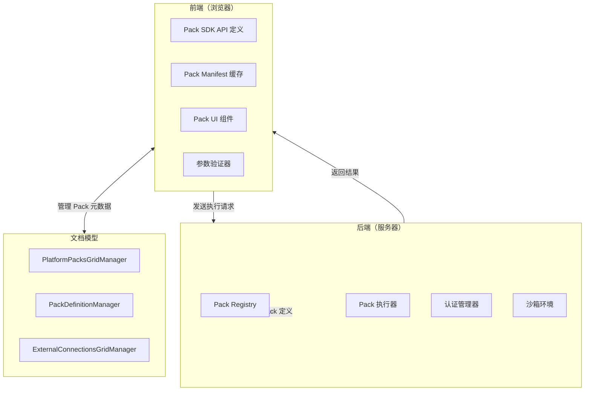
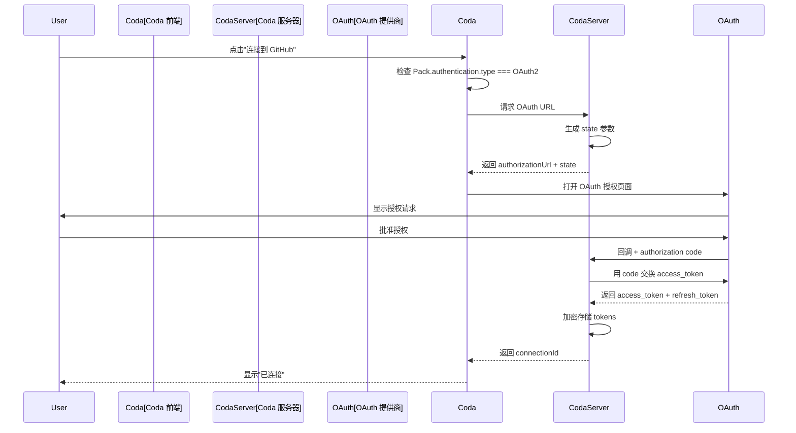
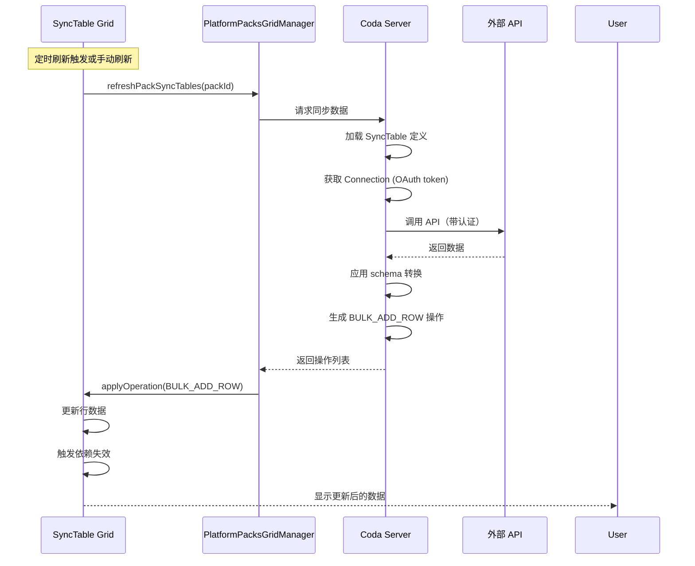
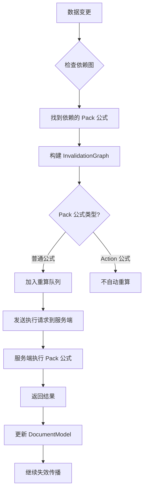
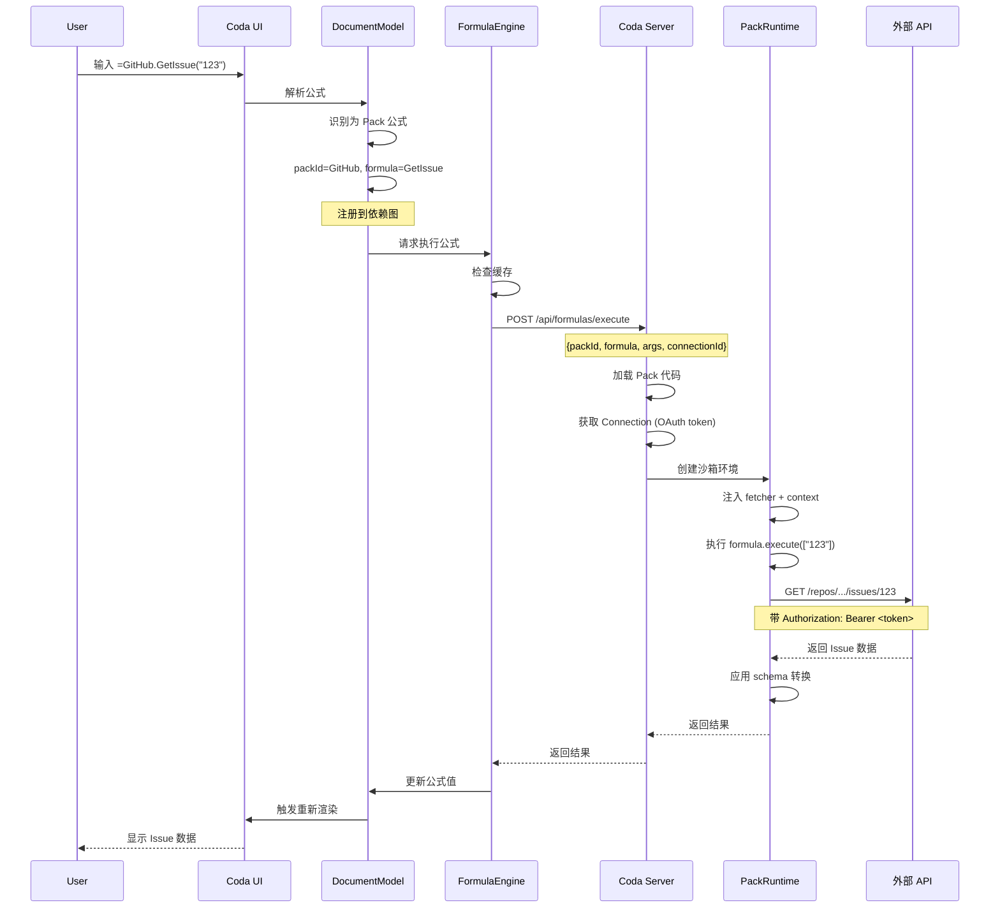
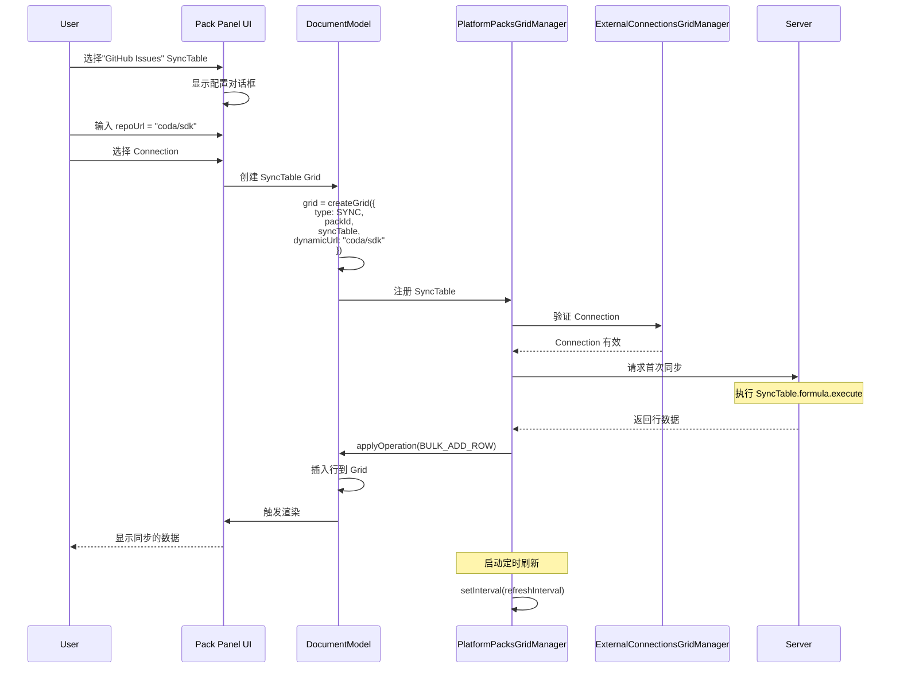
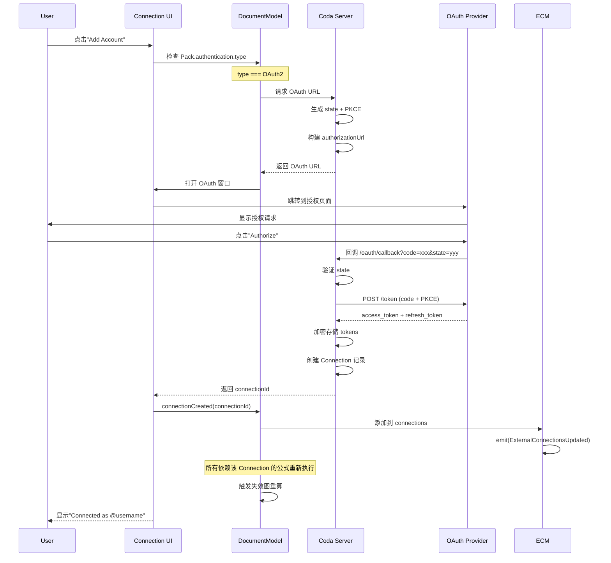
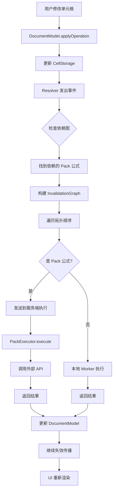

# Coda Pack 深度分析：架构、集成与实现

## 目录

1. [Pack 架构总览](#1-pack-架构总览)
2. [Pack 与公式系统集成](#2-pack-与公式系统集成)
3. [Pack 认证机制](#3-pack-认证机制)
4. [SyncTable 同步机制](#4-synctable-同步机制)
5. [Pack Connection 管理](#5-pack-connection-管理)
6. [Pack 与依赖图交互](#6-pack-与依赖图交互)
7. [Pack 管理器实现](#7-pack-管理器实现)
8. [完整数据流](#8-完整数据流)

---

## 1. Pack 架构总览

### 1.1 核心概念

**Pack** 是 Coda 的扩展机制，允许连接外部服务（如 GitHub、Slack、Jira 等）。Pack 采用**前后端分离架构**：



### 1.2 前后端职责划分

| 功能 | 前端 | 后端 |
|------|------|------|
| **Pack SDK API 定义** | ✅ 类型检查、UI 提示 | ✅ 实际执行环境 |
| **Pack 元数据 (manifest)** | ✅ 本地缓存 | ✅ 权威来源 |
| **Pack 执行代码** | ❌ 无 | ✅ 在沙箱中执行 |
| **公式执行** | ❌ 只发起请求 | ✅ 实际执行 |
| **API 调用** | ❌ 不直接调用 | ✅ 通过 fetcher |
| **认证 Token** | ❌ 不可见 | ✅ 安全管理 |
| **UI 交互** | ✅ 完全处理 | ❌ 无 UI |
| **参数验证** | ✅ 前置验证 | ✅ 最终验证 |

### 1.3 关键文件位置

**前端代码：**
- **Pack SDK API 定义**: `browser.6611b23ea80de0482abc.entry.js` (模块 905044)
  ```javascript
  // Pack SDK 导出的核心 API
  t.makeSyncTable = ...
  t.makeFormula = ...
  t.makeObjectFormula = ...
  t.makeParameter = ...
  t.makeStringFormula = ...
  t.makeNumericFormula = ...
  t.makeDynamicSyncTable = ...
  t.makeMetadataFormula = ...
  ```

- **Pack UI 组件**: `postload.6f4c20e443c95cbdfd2e.chunk.js`
  - 包含 Pack 安装/卸载 UI
  - Pack 连接选择器
  - Pack 配置面板

**数据模型：**
- **PlatformPacksGridManager**: 管理已安装的 Pack
- **PackDefinitionManager**: 管理 Pack 定义和元数据
- **ExternalConnectionsGridManager**: 管理 Pack 连接（认证）

---

## 2. Pack 与公式系统集成

### 2.1 Pack 公式的定义

Pack 可以提供两种类型的公式：

1. **普通公式（Formula）**: 返回值的函数
2. **动作公式（Action）**: 修改外部系统状态的操作（如 AddRow）

**代码位置**: `browser.6611b23ea80de0482abc.entry.js`

```javascript
// Pack 公式的类型定义
makeFormula: function(e) {
  return {
    name: e.name,
    description: e.description,
    parameters: e.parameters,
    resultType: e.resultType,
    execute: e.execute,  // 执行函数（在服务端运行）
    isAction: e.isAction ?? false,
    connectionRequirement: e.connectionRequirement,
    // ...
  };
}
```

### 2.2 Pack 公式如何被识别和调用

**步骤 1: 公式解析**

**代码位置**: `postload.6f4c20e443c95cbdfd2e.chunk.js`

```javascript
// 当用户输入公式时，解析器识别 Pack 引用
// 例如: =GitHub.GetIssue("123")

// 公式解析器会：
// 1. 识别 "GitHub" 是一个 Pack 名称
// 2. 查找 Pack ID
// 3. 验证 "GetIssue" 是该 Pack 的有效公式
// 4. 解析参数 "123"
```

**步骤 2: 公式注册到 DocumentModel**

**代码位置**: `browser.6611b23ea80de0482abc.entry.js`

```javascript
// Pack 安装时，其公式被注册到 packDefinitionManager
class PackDefinitionManager {
  getPack(packId, version) {
    // 返回 Pack 定义，包含所有公式
  }
  
  getFormulas(packId, version) {
    const pack = this.getPack(packId, version);
    return pack?.formulas || [];
  }
}
```

**步骤 3: 公式执行请求**

**代码位置**: `browser.6611b23ea80de0482abc.entry.js`

```javascript
// 当公式需要执行时，FormulaEngine 会：
async executeExpression(expression, context, options) {
  // 1. 检查是否是 Pack 公式
  if (isPack Formula(expression)) {
    // 2. 获取 Pack 连接
    const connection = this._getPackConnection(expression);
    
    // 3. 发送到服务端执行
    return await this._executePackFormula(expression, connection, options);
  }
  // ...
}
```

### 2.3 Pack 公式与依赖图

**代码位置**: `browser.6611b23ea80de0482abc.entry.js`

Pack 公式参与依赖图的方式与普通公式相同：

```javascript
// Pack 公式可以依赖文档中的数据
// 例如: =GitHub.CreateIssue([Title Column], [Description Column])

// 依赖图会记录：
// - Pack 公式依赖 Title Column
// - Pack 公式依赖 Description Column

// 当列值改变时，Pack 公式会被重新执行（如果是 Action 类型则不会自动执行）
```

**Pack 公式引用类型：**

**代码位置**: `browser.6611b23ea80de0482abc.entry.js`

```javascript
// Pack 公式可以返回特殊的引用类型
class PackConnectionReference extends Reference {
  constructor(objectId, fieldName, fieldId, identifier, options) {
    super(RefType.PackConnectionReference, objectId, fieldName, options);
    this.fieldId = fieldId.toString();
    this.identifier = identifier;
  }
  
  get packId() {
    return Number(this.fieldId);
  }
  
  exists(resolver) {
    return resolver.documentModel
      .externalConnectionsGridManager
      .hasConnection(this.getOriginalConnectionId());
  }
}
```

---

## 3. Pack 认证机制

### 3.1 支持的认证类型

**代码位置**: `browser.6611b23ea80de0482abc.entry.js`

```javascript
// Pack 支持的认证类型（枚举）
AuthenticationType = {
  None: "None",
  OAuth2: "OAuth2",
  OAuth2ClientCredentials: "OAuth2ClientCredentials",
  HeaderBearerToken: "HeaderBearerToken",
  CustomHeaderToken: "CustomHeaderToken",
  QueryParamToken: "QueryParamToken",
  MultiQueryParamToken: "MultiQueryParamToken",
  MultiHeaderToken: "MultiHeaderToken",
  WebBasic: "WebBasic",
  Custom: "Custom",
  AWSAccessKey: "AWSAccessKey",
  AWSAssumeRole: "AWSAssumeRole",
  CodaApiHeaderBearerToken: "CodaApiHeaderBearerToken",
  GoogleDomainWideDelegation: "GoogleDomainWideDelegation",
  GoogleServiceAccount: "GoogleServiceAccount",
  Various: "Various"
};
```

### 3.2 OAuth2 认证流程

**代码位置**: `postload.6f4c20e443c95cbdfd2e.chunk.js`



**实际代码片段：**

```javascript
// 启动 OAuth 流程
async launchOAuth({pack, docId, authenticationName}) {
  // 1. 检查是否需要 endpoint URL
  if (pack.authentication.requiresEndpointUrl && 
      !pack.authentication.endpointKey) {
    // 显示 endpoint URL 配置对话框
    return;
  }
  
  // 2. 发起 OAuth 请求
  const oauthUrl = await this._getOAuthUrl(pack, docId, authenticationName);
  
  // 3. 打开 OAuth 窗口
  window.open(oauthUrl, '_blank');
}
```

### 3.3 Connection 存储结构

**代码位置**: `browser.6611b23ea80de0482abc.entry.js`

Pack Connection 有两种类型：

1. **Proxy Connection**: 共享连接（所有用户使用同一个凭证）
2. **Non-Proxy Connection**: 私有连接（每个用户自己的凭证）

```javascript
// Connection 数据结构
interface Connection {
  id: string;               // 连接ID
  originalId: string;       // 原始连接ID（用于跨文档）
  name: string;             // 连接名称（用户可见）
  packId: number;           // Pack ID
  packVersion: string;      // Pack 版本
  type: 'Proxy' | 'NonProxy';
  
  // Proxy 连接专有
  allowNonOwnerToSelect?: boolean;    // 非所有者可选择
  allowActions?: boolean;             // 允许执行 Action
  allowFormulaInvocations?: boolean;  // 允许公式调用
  
  // NonProxy 连接专有
  ownerId?: string;                   // 所有者 ID
}
```

---

## 4. SyncTable 同步机制

### 4.1 SyncTable 概念

**SyncTable** 是 Pack 提供的特殊类型表格，可以从外部 API 同步数据到 Coda 文档。

**特点：**
- 数据定期刷新（可配置间隔）
- 支持增量同步（通过 continuation token）
- 可以是静态或动态（Dynamic SyncTable）

### 4.2 SyncTable 定义

**代码位置**: `browser.6611b23ea80de0482abc.entry.js`

```javascript
// Pack 定义 SyncTable
makeSyncTable({
  name: "Issues",                // SyncTable 名称
  description: "GitHub Issues",  // 描述
  identityName: "Issue",         // 唯一标识（用于行去重）
  
  schema: {                      // 数据 schema
    type: "object",
    id: "issueId",
    primary: "title",
    properties: {
      issueId: { type: "number" },
      title: { type: "string" },
      state: { type: "string" },
      // ...
    }
  },
  
  formula: {                     // 同步公式
    name: "SyncIssues",
    description: "Sync GitHub issues",
    
    parameters: [
      makeParameter({
        type: "string",
        name: "repoUrl",
        description: "Repository URL"
      })
    ],
    
    execute: async function([repoUrl], context) {
      // 在服务端执行，调用 GitHub API
      const response = await context.fetcher.fetch({
        method: "GET",
        url: `https://api.github.com/repos/${repoUrl}/issues`
      });
      
      return {
        result: response.body.map(issue => ({
          issueId: issue.id,
          title: issue.title,
          state: issue.state,
          // ...
        }))
      };
    }
  }
})
```

### 4.3 SyncTable 数据同步流程

**代码位置**: `calc_client.a7f34509781620e1e7da.chunk.js` & `postload.6f4c20e443c95cbdfd2e.chunk.js`



**代码片段：**

```javascript
// SyncTable 刷新逻辑
class PlatformPacksGridManager {
  async refreshPackSyncTables(packId) {
    // 1. 获取所有使用该 Pack 的 SyncTable Grid
    const syncTableGrids = this._getSyncTableGridsForPack(packId);
    
    // 2. 遍历每个 SyncTable
    for (const grid of syncTableGrids) {
      const { syncTable, dynamicUrl } = grid.getSyncRule();
      
      // 3. 获取连接
      const connection = this._getConnectionForSyncTable(grid);
      
      // 4. 调用服务端同步
      await this._executeSyncTable(packId, syncTable, connection, dynamicUrl);
    }
  }
}
```

### 4.4 Dynamic SyncTable

**Dynamic SyncTable** 允许用户动态选择要同步的数据源（如选择特定的 GitHub 仓库）。

**代码位置**: `postload.6f4c20e443c95cbdfd2e.chunk.js`

```javascript
// Dynamic SyncTable 定义
makeDynamicSyncTable({
  name: "DynamicIssues",
  
  // 列出可用的数据源
  listDynamicUrls: async function(context) {
    const repos = await context.fetcher.fetch({
      url: "https://api.github.com/user/repos"
    });
    
    return repos.body.map(repo => ({
      display: repo.full_name,  // 显示名称
      value: repo.url           // 实际 URL
    }));
  },
  
  // 获取指定数据源的 SyncTable 定义
  getName: async function(dynamicUrl, context) {
    const repo = await context.fetcher.fetch({ url: dynamicUrl });
    return `Issues from ${repo.body.full_name}`;
  },
  
  getSchema: async function(dynamicUrl, context) {
    // 返回该数据源的 schema
    return issueSchema;
  },
  
  formula: {
    // 同步指定数据源的数据
    execute: async function([], context) {
      const dynamicUrl = context.sync.dynamicUrl;
      // 从 dynamicUrl 同步数据
      // ...
    }
  }
})
```

### 4.5 增量同步（Continuation）

为了高效同步大量数据，SyncTable 支持增量同步：

```javascript
// SyncTable 公式返回 continuation token
formula: {
  execute: async function([repoUrl], context) {
    let url = `https://api.github.com/repos/${repoUrl}/issues`;
    
    // 如果有 continuation，从上次的位置继续
    if (context.sync.continuation) {
      url = context.sync.continuation.nextUrl;
    }
    
    const response = await context.fetcher.fetch({ url });
    
    return {
      result: response.body,
      
      // 如果还有更多数据，返回 continuation
      continuation: response.body.length > 0 ? {
        nextUrl: response.headers['Link']?.next
      } : undefined
    };
  }
}
```

---

## 5. Pack Connection 管理

### 5.1 ExternalConnectionsGridManager

这是管理所有 Pack 连接的核心管理器。

**代码位置**: `browser.6611b23ea80de0482abc.entry.js` & `postload.6f4c20e443c95cbdfd2e.chunk.js`

```javascript
class ExternalConnectionsGridManager {
  // 获取 Pack 的所有连接
  getConnectionsForPack(packId, packVersion, capabilities) {
    // capabilities: AllowFetches | AllowActions
    // 返回符合条件的连接列表
  }
  
  // 获取 Pack 的默认连接
  getDefaultConnectionForPack(packId, packVersion, options) {
    const connections = this.getConnectionsForPack(packId, packVersion, options.capabilities);
    
    // 优先返回 Proxy 连接
    if (options.connectionType === ConnectionType.Proxy) {
      return connections.find(c => c.type === 'Proxy');
    }
    
    // 或返回第一个可用连接
    return connections[0];
  }
  
  // 获取 Proxy 连接
  getProxyConnectionForPack(packId, packVersion) {
    const connections = this.getConnectionsForPack(packId, packVersion);
    return connections.find(c => c.type === 'Proxy');
  }
  
  // 获取共享连接（供其他用户使用）
  getSharedConnectionsForPack(packId, packVersion) {
    return this.getConnectionsForPack(packId, packVersion)
      .filter(c => c.type === 'NonProxy' && c.allowNonOwnerToSelect);
  }
  
  // 检查连接是否存在
  hasConnection(connectionId) {
    return this.tryGetConnectionById(connectionId) !== undefined;
  }
  
  // 等待 Proxy 连接创建完成
  async waitForProxyConnectionForPack(packId) {
    // 轮询直到 Proxy 连接可用
  }
}
```

### 5.2 Connection 权限模型

**代码位置**: `postload.6f4c20e443c95cbdfd2e.chunk.js`

Connection 有三个关键权限标志：

1. **allowNonOwnerToSelect**: 其他用户可以选择这个连接
2. **allowFormulaInvocations**: 允许在公式中使用
3. **allowActions**: 允许执行 Action（如创建 Issue、发送消息）

```javascript
// 权限检查示例
function canUseConnection(connection, context) {
  // 如果是所有者，总是可以使用
  if (connection.ownerId === context.userId) {
    return true;
  }
  
  // 如果是 Proxy 连接，检查是否允许非所有者选择
  if (connection.type === 'Proxy') {
    return connection.allowNonOwnerToSelect;
  }
  
  // NonProxy 连接，检查共享权限
  if (connection.type === 'NonProxy') {
    return connection.allowNonOwnerToSelect;
  }
  
  return false;
}
```

### 5.3 Connection 与 DocumentModel 交互

**代码位置**: `browser.6611b23ea80de0482abc.entry.js`

```javascript
// Connection 存储在特殊的 Grid 中
// DocumentModel 通过 externalConnectionsGridManager 访问

// 当 Connection 变化时，触发事件
externalConnectionsGridManager.emit(
  QCO.ExternalConnectionsUpdated,
  { connectionId }
);

// 相关组件订阅该事件
this._subscriptions.push({
  emitter: document.externalConnectionsGridManager,
  listeners: {
    [QCO.ExternalConnectionsUpdated]: this._onConnectionsUpdated
  }
});
```

---

## 6. Pack 与依赖图交互

### 6.1 Pack 公式依赖注册

当 Pack 公式引用文档数据时，会在依赖图中注册：

**代码位置**: `browser.6611b23ea80de0482abc.entry.js`

```javascript
// 例如: =GitHub.CreateIssue([Title Column], [Description Column])

// 依赖图会记录:
dependencyGraph.addDataDependency(
  formulaCellRef,           // Pack 公式所在单元格
  titleColumnRef,           // 依赖的 Title Column
  { dependencyType: DATA, context: {...} }
);

dependencyGraph.addDataDependency(
  formulaCellRef,
  descriptionColumnRef,     // 依赖的 Description Column
  { dependencyType: DATA, context: {...} }
);
```

### 6.2 Pack Connection 依赖

Pack 公式还依赖于 Pack Connection（认证凭证）：

**代码位置**: `postload.6f4c20e443c95cbdfd2e.chunk.js`

```javascript
// 当 Pack 公式使用特定的 Connection 时
function checkConnectionDependency(formulaRef, packConnectionRef) {
  // 1. 检查 Connection 是否存在
  const connection = externalConnectionsGridManager
    .tryGetConnection(packConnectionRef.getOriginalConnectionId());
  
  if (!connection) {
    // Connection 不存在，公式显示错误
    return new Error("Connection not found");
  }
  
  // 2. 检查 Connection 是否过期
  if (connection.isExpired) {
    // 触发重新认证流程
    this._reauthConnection(connection.id);
  }
  
  // 3. 当 Connection 更新时，重新执行公式
  this._subscribeToConnection(packConnectionRef, formulaRef);
}
```

### 6.3 Pack 公式失效传播

**代码位置**: `browser.6611b23ea80de0482abc.entry.js`



**代码片段：**

```javascript
// Pack 公式参与失效图
class InvalidationGraph {
  async invalidate({cursor, timeout}) {
    for (const nodeId of this.getTopologicalOrder()) {
      const node = this.nodes.get(nodeId);
      
      if (node.isPackFormula) {
        // Pack 公式需要发送到服务端执行
        const result = await this._executePackFormulaOnServer(node);
        
        // 更新结果
        this._updateNodeResult(nodeId, result);
      } else {
        // 普通公式在本地 Worker 执行
        const result = await this._executeInWorker(node);
        this._updateNodeResult(nodeId, result);
      }
    }
  }
}
```

---

## 7. Pack 管理器实现

### 7.1 PlatformPacksGridManager

负责管理文档中已安装的 Pack。

**代码位置**: `postload.6f4c20e443c95cbdfd2e.chunk.js`

```javascript
class PlatformPacksGridManager extends EventEmitter {
  // 获取所有已安装的 Pack
  getInstalledPacks() {
    return this._installedPacks.values();
  }
  
  // 获取所有激活的 Pack（未禁用）
  getActivePacks() {
    return this.getInstalledPacks().filter(pack => pack.state !== PackState.Disabled);
  }
  
  // 获取禁用的 Pack
  getDisabledPacks() {
    return this.getInstalledPacks().filter(pack => pack.state === PackState.Disabled);
  }
  
  // 检查 Pack 是否已安装
  hasPack(packId) {
    return this._installedPacks.has(packId);
  }
  
  // 获取特定 Pack
  getPack(packId) {
    return this._installedPacks.get(packId);
  }
  
  // 安装 Pack
  async installPackIfNeeded(packId, options) {
    if (this.hasPack(packId)) {
      return; // 已安装
    }
    
    // 1. 加载 Pack 定义
    await this.document.packDefinitionManager.incrementalLoad({
      packId,
      packVersion: LATEST_VERSION
    });
    
    // 2. 创建 Proxy Connection
    const proxyConnection = await this._createProxyConnection(packId);
    
    // 3. 标记为已安装
    this._installedPacks.set(packId, {
      id: packId,
      state: PackState.Installed,
      version: LATEST_VERSION
    });
    
    // 4. 发出事件
    this.emit(PackEvent.PacksChanged, { packId });
  }
  
  // 卸载 Pack
  async uninstallPack(packId) {
    // 1. 检查依赖
    const dependentObjects = this._findDependentObjects(packId);
    if (dependentObjects.length > 0) {
      throw new Error("Cannot uninstall: Pack is in use");
    }
    
    // 2. 删除连接
    await this._removePackConnections(packId);
    
    // 3. 从已安装列表移除
    this._installedPacks.delete(packId);
    
    // 4. 发出事件
    this.emit(PackEvent.PacksUninstalled, { packId });
  }
  
  // 刷新 Pack（重新加载定义）
  async refreshPack(packId, options) {
    const pack = this.getPack(packId);
    
    // 1. 重新加载 Pack 定义
    await this.document.packDefinitionManager.incrementalLoad({
      packId,
      packVersion: pack.version
    });
    
    // 2. 如果指定了 originalConnectionId，刷新该连接的公式
    if (options?.originalConnectionId) {
      await this._refreshConnectionFormulas(packId, options.originalConnectionId);
    }
    
    // 3. 发出事件
    this.emit(PackEvent.PacksChanged, { packId });
  }
  
  // 刷新 Pack 的所有 SyncTable
  async refreshPackSyncTables(packId) {
    const syncTableGrids = this._getSyncTableGridsForPack(packId);
    
    for (const grid of syncTableGrids) {
      await this._refreshSyncTable(grid);
    }
  }
  
  // 设置 SyncTable 刷新间隔
  setRefreshInterval(packId, intervalMinutes) {
    const pack = this.getPack(packId);
    pack.refreshInterval = intervalMinutes;
    
    // 更新定时器
    this._updateRefreshTimer(packId, intervalMinutes);
  }
}
```

### 7.2 PackDefinitionManager

负责管理 Pack 的元数据定义。

**代码位置**: `postload.6f4c20e443c95cbdfd2e.chunk.js`

```javascript
class PackDefinitionManager {
  constructor() {
    this._packCache = new Map(); // 缓存已加载的 Pack 定义
  }
  
  // 获取 Pack 定义
  getPack(packId, version) {
    const cacheKey = `${packId}:${version}`;
    return this._packCache.get(cacheKey);
  }
  
  // 获取 Pack 的最新版本
  getPackLatestVersion(packId) {
    // 查找所有版本中的最新版
    const versions = Array.from(this._packCache.keys())
      .filter(key => key.startsWith(`${packId}:`))
      .map(key => key.split(':')[1]);
    
    const latestVersion = Math.max(...versions);
    return this.getPack(packId, latestVersion);
  }
  
  // 增量加载 Pack 定义
  async incrementalLoad({ packId, packVersion }) {
    const cacheKey = `${packId}:${packVersion}`;
    
    if (this._packCache.has(cacheKey)) {
      return; // 已缓存
    }
    
    // 1. 从服务器加载 Pack manifest
    const manifest = await this._fetchPackManifest(packId, packVersion);
    
    // 2. 缓存
    this._packCache.set(cacheKey, manifest);
    
    // 3. 返回
    return manifest;
  }
  
  // 获取 Pack 的所有公式
  getFormulas(packId, version) {
    const pack = this.getPack(packId, version);
    return pack?.formulas || [];
  }
  
  // 获取 Pack 的所有 SyncTable
  getSyncTables(packId, version) {
    const pack = this.getPack(packId, version);
    return pack?.syncTables || [];
  }
  
  // 根据 identityName 查找 SyncTable
  tryGetSyncTableByIdentityName(packId, version, identityName) {
    const syncTables = this.getSyncTables(packId, version);
    return syncTables.find(st => st.identityName === identityName);
  }
  
  // 获取 Pack 的列格式
  getFormats(packId, version) {
    const pack = this.getPack(packId, version);
    return pack?.formats || [];
  }
}
```

---

## 8. 完整数据流

### 8.1 Pack 公式执行完整流程



### 8.2 SyncTable 首次创建流程



### 8.3 Pack Connection 创建流程（OAuth2）



### 8.4 数据变更触发 Pack 公式重算



---

## 9. 关键代码位置总结

| 功能 | 文件 | 说明 |
|------|------|------|
| **Pack SDK API** | `browser.6611b23ea80de0482abc.entry.js` | 模块 905044，包含所有 Pack SDK API |
| **Pack UI 组件** | `postload.6f4c20e443c95cbdfd2e.chunk.js` | Pack 安装、配置、连接管理 UI |
| **PlatformPacksGridManager** | `postload.6f4c20e443c95cbdfd2e.chunk.js` | 管理已安装 Pack |
| **PackDefinitionManager** | `postload.6f4c20e443c95cbdfd2e.chunk.js` | 管理 Pack 定义和元数据 |
| **ExternalConnectionsGridManager** | `browser.6611b23ea80de0482abc.entry.js` & `postload.*.js` | 管理 Pack 连接 |
| **Pack 公式执行** | `browser.6611b23ea80de0482abc.entry.js` | FormulaEngine 与 Pack 集成 |
| **SyncTable 管理** | `calc_client.a7f34509781620e1e7da.chunk.js` | SyncTable 数据同步逻辑 |
| **Pack Reference 类型** | `browser.6611b23ea80de0482abc.entry.js` | PackConnectionReference 类定义 |
| **OAuth 流程** | `postload.6f4c20e443c95cbdfd2e.chunk.js` | OAuth2 认证流程实现 |
| **依赖图集成** | `browser.6611b23ea80de0482abc.entry.js` | Pack 公式依赖注册和失效 |

---

## 10. Pack 与其他系统的集成点

### 10.1 与公式系统集成

- **FormulaEngine**: Pack 公式通过 FormulaEngine 统一执行入口
- **DependencyGraph**: Pack 公式参与依赖图，支持数据驱动重算
- **InvalidationGraph**: 数据变更时，Pack 公式被加入失效图
- **Worker**: 普通公式在 Worker 执行，Pack 公式发送到服务端

### 10.2 与协同系统集成

- **SyncEngine**: Pack 连接变更通过 SyncEngine 同步到其他用户
- **Operation**: Pack 相关的操作（如 BULK_ADD_ROW from SyncTable）参与 OT
- **UncommittedLog**: 本地 Pack 操作在确认前存储在未提交日志

### 10.3 与渲染系统集成

- **Grid View**: SyncTable 数据通过 Grid 组件渲染
- **Canvas**: Pack 公式结果可以嵌入 Canvas（如 Card、Button）
- **Slate**: Pack 返回的富文本内容可以插入 Slate 块树

### 10.4 与权限系统集成

- **DocumentPermissions**: Pack 安装需要编辑权限
- **ConnectionPermissions**: Connection 共享受权限控制
- **WorkspacePermissions**: 某些 Pack 仅对特定 Workspace 可用

---

## 总结

Coda Pack 是一个**前后端混合架构**：

1. **前端**负责：
   - Pack 元数据缓存和 UI 展示
   - 参数验证和用户交互
   - Connection 管理 UI
   - 与 DocumentModel 集成

2. **后端**负责：
   - Pack 代码的安全执行（沙箱）
   - 认证凭证的安全存储和管理
   - 外部 API 调用
   - SyncTable 数据同步

3. **核心集成点**：
   - 通过 `PlatformPacksGridManager` 管理 Pack 生命周期
   - 通过 `ExternalConnectionsGridManager` 管理认证
   - 通过 `FormulaEngine` 和 `DependencyGraph` 集成到公式系统
   - 通过 `BULK_ADD_ROW` 等操作集成到协同系统

这种架构确保了**安全性**（凭证不暴露给前端）、**性能**（服务端调用外部 API 更稳定）、**用户体验**（前端提供即时反馈），同时保持了与 Coda 文档模型的深度集成。
