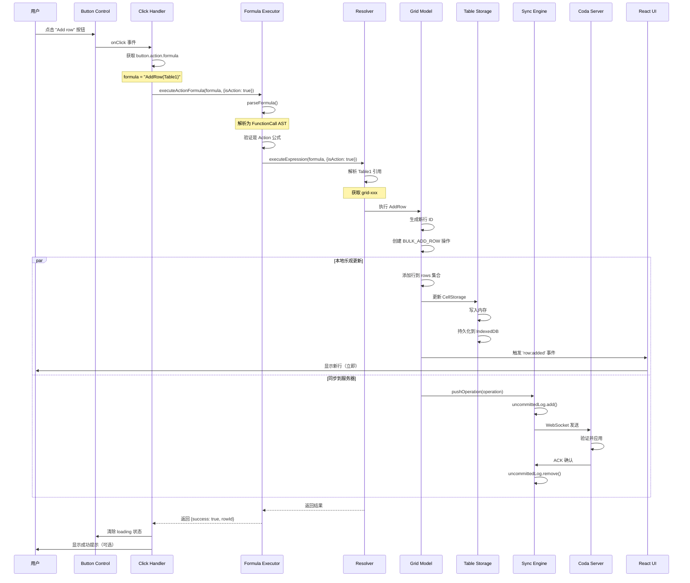

# Coda Add Row 按钮的真实实现机制

> **重要发现**：Coda 的 Add Row 按钮实际上是通过 **Button Control + AddRow 公式** 来实现的，而不是直接调用 JavaScript 方法。

---

## 📋 核心发现

### 🔑 关键点

1. **表格底部的 "Add row" 按钮是一个 Button Control**
2. **Button Control 绑定了一个 AddRow 公式作为 action**
3. **点击按钮时，执行绑定的 AddRow 公式**
4. **AddRow 是一个 Action 类型的公式，会修改数据**

---

## 1. Button Control 概念

### 1.1 什么是 Control？

在 Coda 中，**Control** 是一种特殊的 Block 类型，用于用户交互：

```typescript
type Control = {
  type: 'control',
  id: string,
  controlType: 'button' | 'slider' | 'select' | 'datePicker' | ...,
  
  // Button Control 特有属性
  label: string,           // 按钮文本，如 "Add row"
  action: Formula,         // 绑定的 action 公式
  style: ButtonStyle,      // 按钮样式
  disabled: boolean | Formula,  // 是否禁用（可以是公式）
}
```

### 1.2 Button Control 的数据结构

```javascript
// 在 DocumentModel 中的实际结构
{
  type: 'control',
  id: 'ctrl-add-row-btn-xyz',
  controlType: 'button',
  
  // 按钮配置
  label: 'Add row',
  
  // 🔴 关键：绑定的 action 公式
  action: {
    type: 'formula',
    formula: 'AddRow($$[grid:grid-xxx:::false:false:Table])',
    isAction: true  // 标记为 action 类型
  },
  
  // 样式配置
  style: {
    variant: 'primary',  // 主按钮样式
    size: 'medium',
    icon: 'plus'
  },
  
  // 位置信息
  gridId: 'grid-xxx',  // 关联的表格 ID
  placement: 'table-footer'  // 放置在表格底部
}
```

---

## 2. Add Row 按钮的完整工作流程

### 2.1 按钮渲染

```jsx
// React 组件渲染 Button Control
function ButtonControl({ control, grid }) {
  const { label, action, style, disabled } = control;
  
  // 检查是否禁用
  const isDisabled = typeof disabled === 'object' 
    ? evaluateFormula(disabled)  // 如果是公式，先求值
    : disabled;
  
  return (
    <button
      className={`coda-button ${style.variant}`}
      disabled={isDisabled}
      onClick={() => handleButtonClick(control, grid)}
    >
      {style.icon && <Icon name={style.icon} />}
      <span>{label}</span>
    </button>
  );
}
```

### 2.2 按钮点击事件处理

```javascript
/**
 * 按钮点击时触发
 */
async function handleButtonClick(control, grid) {
  const { action } = control;
  
  if (!action || !action.formula) {
    console.warn('Button has no action formula');
    return;
  }
  
  // 🔴 关键：执行绑定的 action 公式
  try {
    // 显示加载状态
    setButtonLoading(control.id, true);
    
    // 执行公式
    const result = await executeActionFormula(
      action.formula,
      {
        objectId: grid.id,
        isAction: true,  // 标记为 action
        context: {
          buttonId: control.id,
          triggeredBy: 'button_click'
        }
      }
    );
    
    console.log('Action executed successfully:', result);
    
    // 清除加载状态
    setButtonLoading(control.id, false);
    
    // 可选：显示成功提示
    showToast('Row added successfully');
    
  } catch (error) {
    console.error('Action execution failed:', error);
    setButtonLoading(control.id, false);
    showToast(`Error: ${error.message}`, 'error');
  }
}
```

### 2.3 执行 Action 公式

```javascript
/**
 * 执行 Action 类型的公式
 */
async function executeActionFormula(formula, options) {
  const resolver = window.coda.documentModel.session.resolver;
  
  // 🔴 步骤 1: 解析公式
  const parsed = parseFormula(formula);
  // parsed.type = 'FunctionCall'
  // parsed.name = 'AddRow'
  // parsed.args = [gridRef, columnValues, ...]
  
  // 🔴 步骤 2: 验证是 action 公式
  const funcDef = getFunctionDefinition(parsed.name);
  if (!funcDef.isAction) {
    throw new Error(`${parsed.name} is not an action formula`);
  }
  
  // 🔴 步骤 3: 执行公式（标记为 action）
  const result = await resolver.executeExpression(
    formula,
    {
      objectId: options.objectId,
      isAction: true,  // 🔑 非常重要！
      context: options.context
    }
  );
  
  return result;
}
```

---

## 3. AddRow 公式执行详解

### 3.1 AddRow 公式的定义

```javascript
// AddRow 是一个内置的 Action 公式
const AddRowFormula = {
  name: 'AddRow',
  isAction: true,  // 🔑 标记为 action
  
  // 参数定义
  parameters: [
    {
      name: 'target',
      type: 'TableReference',  // 目标表格
      required: true
    },
    {
      name: 'values',
      type: 'Object',  // 列值（可选）
      required: false
    }
  ],
  
  // 执行函数
  async execute(target, values = {}, context) {
    // 获取目标表格
    const grid = context.resolver.typedGetters.tryGetGrid(target.gridId);
    
    if (!grid) {
      throw new Error(`Table not found: ${target.gridId}`);
    }
    
    // 创建 BULK_ADD_ROW 操作
    const operation = context.document.uncommittedOperationCreator.createOperation(
      'BULK_ADD_ROW',
      {
        gridId: grid.id,
        rows: {
          [newRowId]: {
            rowNumber: grid.rows.length,
            values: values
          }
        }
      }
    );
    
    // 应用操作（乐观更新）
    await grid.applyOperation(operation);
    
    // 发送到服务器
    await context.document.syncEngine.pushOperation(operation);
    
    return { success: true, rowId: newRowId };
  }
};
```

### 3.2 AddRow 公式的使用示例

```javascript
// 🎯 示例 1: 添加空行
AddRow(Table1)

// 🎯 示例 2: 添加带初始值的行
AddRow(
  Table1,
  {
    Name: "John Doe",
    Age: 30,
    Email: "john@example.com"
  }
)

// 🎯 示例 3: 使用其他单元格的值
AddRow(
  Table1,
  {
    Name: [Name Column],
    Date: Today()
  }
)

// 🎯 示例 4: 完整的引用格式（实际代码中的格式）
AddRow(
  $$[grid:grid-pGMwNYE-Z0:::false:false:Table],
  $$[column:grid:grid-pGMwNYE-Z0:c-f_bxR6fSiZ::false:false:Column 2],
  "value"
)
```

---

## 4. Button Control 创建和配置

### 4.1 如何创建一个 Add Row 按钮

```javascript
/**
 * 创建一个 Add Row 按钮
 */
function createAddRowButton(grid) {
  // 生成 Button Control ID
  const controlId = generateControlId('button');
  
  // 创建 Button Control 对象
  const buttonControl = {
    type: 'control',
    id: controlId,
    controlType: 'button',
    
    label: 'Add row',
    
    // 🔴 绑定 AddRow 公式
    action: {
      type: 'formula',
      formula: `AddRow($$[grid:${grid.id}:::false:false:${grid.name}])`,
      isAction: true
    },
    
    style: {
      variant: 'primary',
      size: 'medium',
      icon: 'plus'
    },
    
    disabled: false,
    
    // 关联到表格
    gridId: grid.id,
    placement: 'table-footer'
  };
  
  // 注册到 DocumentModel
  const resolver = window.coda.documentModel.session.resolver;
  resolver.registerObject(buttonControl);
  
  // 添加到表格的 controls 列表
  grid.controls.push(controlId);
  
  return buttonControl;
}
```

### 4.2 高级按钮配置

```javascript
/**
 * 创建一个带条件的 Add Row 按钮
 */
function createConditionalAddRowButton(grid) {
  return {
    type: 'control',
    id: generateControlId('button'),
    controlType: 'button',
    
    label: 'Add row',
    
    // Action 公式：添加行并设置默认值
    action: {
      type: 'formula',
      formula: `AddRow(
        ${serializeGridRef(grid)},
        {
          CreatedAt: Today(),
          CreatedBy: User().Name,
          Status: "Draft"
        }
      )`,
      isAction: true
    },
    
    // 🔴 禁用条件（公式）：如果行数超过 100，禁用按钮
    disabled: {
      type: 'formula',
      formula: `Count(${serializeGridRef(grid)}.Rows) >= 100`,
      isAction: false  // 这是计算公式，不是 action
    },
    
    style: {
      variant: 'primary',
      size: 'medium',
      icon: 'plus'
    }
  };
}
```

---

## 5. 完整执行流程图



---

## 6. 在浏览器控制台中验证

### 6.1 查看表格的 Button Controls

```javascript
// 获取表格
const grids = window.coda.documentModel.getCanvasGrids();
const grid = grids[0];

// 查看表格关联的 controls
console.log('Grid controls:', grid.controls);

// 获取每个 control 的详情
const resolver = window.coda.documentModel.session.resolver;
grid.controls.forEach(controlId => {
  const control = resolver.getById(controlId);
  
  if (control && control.controlType === 'button') {
    console.log('Button Control:', {
      id: control.id,
      label: control.label,
      action: control.action,
      formula: control.action?.formula,
      isAction: control.action?.isAction
    });
  }
});
```

### 6.2 手动触发 Button Action

```javascript
// 获取 Button Control
const buttonControl = resolver.getById('ctrl-add-row-btn-xyz');

// 手动执行 button 的 action
if (buttonControl && buttonControl.action) {
  const formula = buttonControl.action.formula;
  
  console.log('执行公式:', formula);
  
  // 执行
  resolver.executeExpression(formula, {
    objectId: buttonControl.gridId,
    isAction: true  // 🔑 必须标记为 action
  }).then(result => {
    console.log('执行结果:', result);
  }).catch(error => {
    console.error('执行失败:', error);
  });
}
```

### 6.3 创建自定义 Add Row 按钮

```javascript
// 在控制台中创建一个自定义按钮
const grid = window.coda.documentModel.getCanvasGrids()[0];

// 按钮配置
const customButton = {
  type: 'control',
  id: 'ctrl-custom-' + Date.now(),
  controlType: 'button',
  label: 'Quick Add',
  
  action: {
    type: 'formula',
    formula: `AddRow($$[grid:${grid.id}:::false:false:${grid.name}], {Status: "New", Date: Today()})`,
    isAction: true
  },
  
  style: {
    variant: 'secondary',
    size: 'small',
    icon: 'zap'
  }
};

// 注册（注意：这只是演示，实际注册需要更复杂的步骤）
console.log('自定义按钮配置:', customButton);
```

---

## 7. 关键技术要点

### 7.1 Button Control vs 普通按钮

| 特性 | Button Control | 普通 HTML 按钮 |
|-----|---------------|---------------|
| **数据存储** | 存在 DocumentModel 中 | 只存在于代码中 |
| **Action 绑定** | 通过公式绑定 | 通过 JS 函数绑定 |
| **协作同步** | 自动同步到所有用户 | 不同步 |
| **权限控制** | 可配置权限 | 依赖代码逻辑 |
| **撤销/重做** | 支持 | 需手动实现 |
| **公式驱动** | 是 | 否 |

### 7.2 Action 公式的特点

```javascript
// Action 公式的关键特性
const actionFormulaCharacteristics = {
  // 1. 修改数据
  modifiesData: true,
  
  // 2. 不能在单元格中直接使用
  canBeUsedInCell: false,
  
  // 3. 必须通过 Button 或 Automation 触发
  triggerMethod: ['button', 'automation', 'api'],
  
  // 4. 执行时标记 isAction: true
  executionOptions: {
    isAction: true
  },
  
  // 5. 可能有副作用
  hasSideEffects: true,
  
  // 6. 不会被缓存
  cacheable: false
};
```

### 7.3 为什么使用公式而不是直接调用方法？

**原因分析**：

1. **统一的执行模型**
   ```javascript
   // ✅ 统一：所有操作都通过公式引擎
   button.action = "AddRow(Table1)"
   automation.action = "SendEmail(User())"
   api.action = "ModifyRows(Table1, Filter)"
   
   // ❌ 混乱：不同类型用不同方式
   button.onClick = grid.addRow
   automation.trigger = emailService.send
   ```

2. **声明式编程**
   ```javascript
   // ✅ 声明式：描述"做什么"
   action: "AddRow(Table1, {Name: User().Name})"
   
   // ❌ 命令式：描述"怎么做"
   action: () => {
     const user = getCurrentUser();
     const grid = getGrid('Table1');
     grid.addRow({ Name: user.name });
   }
   ```

3. **序列化和存储**
   ```javascript
   // ✅ 可以序列化为 JSON 存储
   {
     action: {
       formula: "AddRow(Table1)",
       isAction: true
     }
   }
   
   // ❌ 函数无法序列化
   {
     action: function() { ... }  // 无法存储到数据库
   }
   ```

4. **协作和同步**
   ```javascript
   // ✅ 公式可以同步到所有用户
   // 用户 A 创建按钮 → 用户 B 自动看到并可以使用
   
   // ❌ JS 函数无法同步
   // 用户 A 的代码 ≠ 用户 B 的代码
   ```

5. **安全性**
   ```javascript
   // ✅ 公式在沙箱中执行，有权限控制
   formula: "AddRow(Table1)"  // 检查用户是否有 Table1 的编辑权限
   
   // ❌ JS 函数可以访问任何东西
   function() { window.location = "malicious.com" }  // 危险！
   ```

---

## 8. 调试技巧

### 8.1 监控 Button Click

```javascript
// 拦截所有 button action 执行
const originalExecute = window.coda.documentModel.session.resolver.executeExpression;

window.coda.documentModel.session.resolver.executeExpression = async function(formula, options) {
  if (options && options.isAction) {
    console.log('🔵 Button Action 执行:');
    console.log('  Formula:', formula);
    console.log('  Options:', options);
    debugger;  // 🔴 断点
  }
  
  const result = await originalExecute.call(this, formula, options);
  
  if (options && options.isAction) {
    console.log('✅ Action 完成:', result);
  }
  
  return result;
};
```

### 8.2 查看 Button 的 Formula

```javascript
// 查看所有 button controls 及其 formulas
function listAllButtonActions() {
  const resolver = window.coda.documentModel.session.resolver;
  const allObjects = resolver.getAllObjects();
  
  const buttons = allObjects.filter(obj => 
    obj.type === 'control' && obj.controlType === 'button'
  );
  
  buttons.forEach(button => {
    console.log(`Button: "${button.label}"`);
    console.log(`  ID: ${button.id}`);
    console.log(`  Formula: ${button.action?.formula}`);
    console.log(`  Grid: ${button.gridId}`);
    console.log('---');
  });
}

listAllButtonActions();
```

### 8.3 测试 AddRow 公式

```javascript
// 直接执行 AddRow 公式
const grid = window.coda.documentModel.getCanvasGrids()[0];
const formula = `AddRow($$[grid:${grid.id}:::false:false:${grid.name}])`;

console.log('测试公式:', formula);

window.coda.documentModel.session.resolver.executeExpression(
  formula,
  {
    objectId: grid.id,
    isAction: true
  }
).then(result => {
  console.log('✅ 添加成功:', result);
}).catch(error => {
  console.error('❌ 添加失败:', error);
});
```

---

## 9. 总结

### 核心发现

1. ✅ **Add Row 按钮是一个 Button Control**，不是普通的 HTML 按钮
2. ✅ **Button Control 绑定了 AddRow 公式**，而不是直接调用 JS 方法
3. ✅ **点击按钮时执行公式**，公式再创建 `BULK_ADD_ROW` 操作
4. ✅ **AddRow 是 Action 类型公式**，专门用于修改数据
5. ✅ **使用公式的原因**：统一执行模型、声明式编程、可序列化、协作同步、安全性

### 架构优势

```
Button Control (声明式配置)
  ↓
绑定 AddRow Formula (公式引擎)
  ↓
创建 BULK_ADD_ROW Operation (操作系统)
  ↓
应用到 Grid Model (数据模型)
  ↓
同步到 Server (协作系统)
```

这种设计使得 Coda 能够：
- 🎨 用户可以自定义按钮和公式
- 🔄 按钮配置可以协作和同步
- 🔐 公式执行有权限控制
- ↩️ 所有操作可以撤销/重做
- 📝 所有变更都有审计日志

关键代码位置：
- `browser.6611b23ea80de0482abc.entry.js` - Formula Executor, Resolver
- `postload.6f4c20e443c95cbdfd2e.chunk.js` - Button Control 组件, Action 处理

