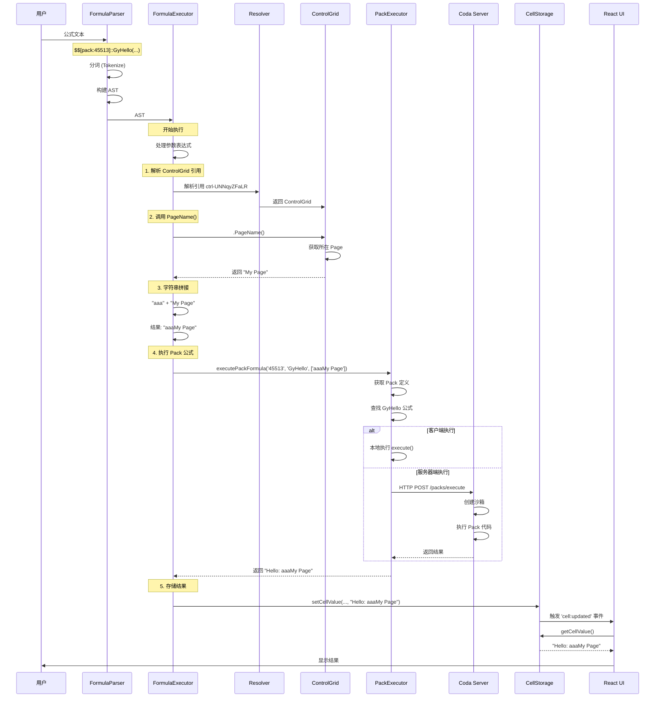

# 复杂公式执行流程分析

## 🎯 公式示例

```javascript
$$[pack:45513:::false:false:Untitled]::GyHello("aaa" + $$[controlGrid:ctrl-UNNqyZFaLR:::false:false:openbaidu].PageName())
```

## 📊 公式结构拆解

```
公式组成部分：
├── Pack 引用：$$[pack:45513:::false:false:Untitled]
├── Pack 函数：::GyHello(...)
├── 参数：
│   └── 字符串拼接：
│       ├── 字符串字面量："aaa"
│       ├── 操作符：+
│       └── Control Grid 方法调用：
│           ├── Control 引用：$$[controlGrid:ctrl-UNNqyZFaLR:::false:false:openbaidu]
│           └── 方法：.PageName()
```

---

## 🔍 Step 1: 公式解析（Parse）

### 1.1 解析器输入

**文件位置**: `browser.6611b23ea80de0482abc.entry.js`

```javascript
/**
 * FormulaParser 解析公式
 */
class FormulaParser {
  parse(formula) {
    // 输入公式文本
    const input = `$$[pack:45513:::false:false:Untitled]::GyHello("aaa" + $$[controlGrid:ctrl-UNNqyZFaLR:::false:false:openbaidu].PageName())`;
    
    // 分词
    const tokens = this.tokenize(input);
    // tokens = [
    //   { type: 'ObjectReference', value: '$$[pack:45513:::false:false:Untitled]' },
    //   { type: 'DoubleColon', value: '::' },
    //   { type: 'Identifier', value: 'GyHello' },
    //   { type: 'LeftParen', value: '(' },
    //   { type: 'String', value: '"aaa"' },
    //   { type: 'Plus', value: '+' },
    //   { type: 'ObjectReference', value: '$$[controlGrid:ctrl-UNNqyZFaLR:::false:false:openbaidu]' },
    //   { type: 'Dot', value: '.' },
    //   { type: 'Identifier', value: 'PageName' },
    //   { type: 'LeftParen', value: '(' },
    //   { type: 'RightParen', value: ')' },
    //   { type: 'RightParen', value: ')' }
    // ]
    
    // 构建 AST
    return this.buildAST(tokens);
  }
}
```

### 1.2 生成的 AST

```javascript
/**
 * 抽象语法树结构
 */
const ast = {
  type: 'PackFormulaCall',           // Pack 公式调用
  pack: {
    type: 'ObjectReference',
    objectType: 'pack',
    objectId: '45513',                // Pack ID
    displayName: 'Untitled'
  },
  formulaName: 'GyHello',             // Pack 公式名称
  arguments: [                         // 参数列表
    {
      type: 'BinaryOp',               // 二元操作
      operator: '+',                  // 字符串拼接
      left: {
        type: 'Literal',
        valueType: 'String',
        value: 'aaa'                  // 左侧：字符串 "aaa"
      },
      right: {
        type: 'MethodCall',           // 右侧：方法调用
        object: {
          type: 'ObjectReference',
          objectType: 'controlGrid',
          objectId: 'ctrl-UNNqyZFaLR', // Control Grid ID
          displayName: 'openbaidu'
        },
        methodName: 'PageName',       // 方法名
        arguments: []                 // 无参数
      }
    }
  ]
};
```

---

## 🔍 Step 2: 执行参数求值（从内到外）

### 2.1 解析 ControlGrid 引用

**文件位置**: `browser.6611b23ea80de0482abc.entry.js`

```javascript
/**
 * 解析对象引用
 * $$[controlGrid:ctrl-UNNqyZFaLR:::false:false:openbaidu]
 */
function parseObjectReference(refString) {
  // 格式：$$[type:objectId:fieldId:identifier:locked:deleted:displayName]
  const match = refString.match(/\$\$\[([^:]+):([^:]+):([^:]*):([^:]*):([^:]+):([^:]+):([^\]]+)\]/);
  
  return {
    type: match[1],         // 'controlGrid'
    objectId: match[2],     // 'ctrl-UNNqyZFaLR'
    fieldId: match[3],      // ''
    identifier: match[4],   // ''
    locked: match[5],       // 'false'
    deleted: match[6],      // 'false'
    displayName: match[7]   // 'openbaidu'
  };
}

/**
 * 解析结果
 */
const controlRef = {
  type: 'controlGrid',
  objectId: 'ctrl-UNNqyZFaLR',
  displayName: 'openbaidu'
};
```

### 2.2 获取 ControlGrid 对象

**文件位置**: `browser.6611b23ea80de0482abc.entry.js`

```javascript
/**
 * 从引用获取实际对象
 */
class ValueResolver {
  async resolveReference(ref) {
    const { objectId, objectType } = ref;
    
    // 根据类型获取对象
    switch (objectType) {
      case 'controlGrid':
        // 从 Resolver 获取 ControlGrid
        return this.resolver.typedGetters.tryGetControlGrid(objectId);
        
      case 'grid':
        return this.resolver.typedGetters.tryGetGrid(objectId);
        
      case 'column':
        return this.resolver.typedGetters.tryGetColumn(
          ref.objectId,
          ref.fieldId
        );
        
      // ... 其他类型
    }
  }
}

/**
 * 实际执行
 */
const control = resolver.typedGetters.tryGetControlGrid('ctrl-UNNqyZFaLR');

// control = ControlGrid {
//   id: 'ctrl-UNNqyZFaLR',
//   name: 'openbaidu',
//   controlType: 'Button',
//   columns: [...],
//   rows: [...]
// }
```

### 2.3 调用 PageName() 方法

**文件位置**: `browser.6611b23ea80de0482abc.entry.js`

```javascript
/**
 * ControlGrid 的 PageName() 方法
 */
class ControlGrid {
  /**
   * 获取所在页面的名称
   */
  PageName() {
    // 1. 获取 Control 所在的 Canvas
    const context = this.getObjectContext();
    // context = { parentId: 'canvas-001', ... }
    
    // 2. 从 Canvas 获取 Page
    const canvas = this.document.session.resolver
      .typedGetters
      .tryGetPageCanvas(context.parentId);
    
    if (!canvas) return '';
    
    // 3. 从 PagesManager 获取 Page
    const page = this.document.pagesManager
      .getPageForCanvasId(canvas.id);
    
    if (!page) return '';
    
    // 4. 返回页面名称
    return page.name;
  }
}

/**
 * 实际执行
 */
const pageNameResult = control.PageName();
// pageNameResult = "My Page" (假设页面名称是 "My Page")
```

### 2.4 字符串拼接

**文件位置**: `browser.6611b23ea80de0482abc.entry.js`

```javascript
/**
 * 执行二元操作：字符串拼接
 */
class FormulaExecutor {
  executeBinaryOp(ast, context) {
    const { operator, left, right } = ast;
    
    // 1. 求值左侧
    const leftValue = this.evaluate(left, context);
    // leftValue = "aaa"
    
    // 2. 求值右侧（方法调用）
    const rightValue = this.evaluate(right, context);
    // rightValue = "My Page"
    
    // 3. 执行操作
    switch (operator) {
      case '+':
        // 字符串拼接
        return String(leftValue) + String(rightValue);
    }
  }
}

/**
 * 实际执行
 */
const concatenated = "aaa" + "My Page";
// concatenated = "aaaMy Page"
```

---

## 🔍 Step 3: 执行 Pack 公式

### 3.1 获取 Pack 对象

**文件位置**: `browser.6611b23ea80de0482abc.entry.js`

```javascript
/**
 * 获取 Pack 定义
 */
class PackDefinitionManager {
  getPack(packId) {
    // 从缓存或服务器获取 Pack 定义
    return this._packCache.get(packId) || 
           this._fetchPackFromServer(packId);
  }
}

/**
 * 实际执行
 */
const packDef = document.packDefinitionManager.getPack('45513');

// packDef = {
//   id: '45513',
//   name: 'Untitled',
//   formulas: [
//     {
//       name: 'GyHello',
//       description: '...',
//       parameters: [
//         { name: 'message', type: 'String' }
//       ],
//       resultType: 'String',
//       execute: async function(args, context) {
//         // Pack 函数的实际实现
//         return `Hello: ${args[0]}`;
//       }
//     }
//   ]
// }
```

### 3.2 查找公式定义

**文件位置**: `browser.6611b23ea80de0482abc.entry.js`

```javascript
/**
 * 在 Pack 中查找公式
 */
function findPackFormula(packDef, formulaName) {
  return packDef.formulas.find(f => f.name === formulaName);
}

/**
 * 实际执行
 */
const formulaDef = findPackFormula(packDef, 'GyHello');

// formulaDef = {
//   name: 'GyHello',
//   parameters: [{ name: 'message', type: 'String' }],
//   execute: async function(args, context) {
//     return `Hello: ${args[0]}`;
//   }
// }
```

### 3.3 准备执行上下文

**文件位置**: `browser.6611b23ea80de0482abc.entry.js`

```javascript
/**
 * 构建 Pack 公式执行上下文
 */
class PackFormulaExecutor {
  async prepareContext(packId, formulaDef, document) {
    // 1. 获取 Pack 连接（如果需要 OAuth）
    const connection = await this._getPackConnection(packId);
    
    // 2. 获取 Fetcher（用于 API 调用）
    const fetcher = this._createFetcher(connection);
    
    // 3. 构建上下文
    return {
      fetcher,                          // API 请求器
      temporaryBlobStorage: {...},      // 临时文件存储
      logger: {...},                    // 日志记录器
      endpoint: 'https://coda.io',      // API 端点
      invocationLocation: {...},        // 调用位置信息
      timezone: 'America/Los_Angeles',  // 时区
      invocationToken: '...',           // 调用令牌
      sync: undefined                   // 同步上下文（如果是 SyncTable）
    };
  }
}
```

### 3.4 执行 Pack 公式

**文件位置**: `calc_client.a7f34509781620e1e7da.chunk.js`

```javascript
/**
 * 执行 Pack 公式
 */
class PackFormulaExecutor {
  async executePackFormula(packId, formulaName, args, context) {
    // 1. 获取 Pack 定义
    const packDef = this.packDefinitionManager.getPack(packId);
    
    // 2. 查找公式
    const formulaDef = packDef.formulas.find(f => f.name === formulaName);
    
    // 3. 准备参数
    const preparedArgs = this._prepareArguments(formulaDef, args);
    // preparedArgs = ["aaaMy Page"]
    
    // 4. 准备上下文
    const execContext = await this.prepareContext(packId, formulaDef, this.document);
    
    // 5. 执行公式（可能在服务器端）
    let result;
    
    if (formulaDef.isAction) {
      // Action 公式在服务器端执行
      result = await this._executeOnServer(packId, formulaName, preparedArgs, execContext);
    } else {
      // 普通公式可能在客户端执行
      if (formulaDef.cacheTtlSecs) {
        // 检查缓存
        const cached = this._getFromCache(packId, formulaName, preparedArgs);
        if (cached) return cached;
      }
      
      // 调用 Pack 的 execute 函数
      result = await formulaDef.execute(preparedArgs, execContext);
    }
    
    // 6. 返回结果
    return result;
  }
}

/**
 * 实际执行
 */
const result = await packExecutor.executePackFormula(
  '45513',                  // Pack ID
  'GyHello',                // 公式名
  ['aaaMy Page'],           // 参数
  context                   // 执行上下文
);

// result = "Hello: aaaMy Page"
```

---

## 🔍 Step 4: 服务器端执行（如果需要）

### 4.1 发送到服务器

**文件位置**: `calc_client.a7f34509781620e1e7da.chunk.js`

```javascript
/**
 * 在服务器端执行 Pack 公式
 */
async _executeOnServer(packId, formulaName, args, context) {
  // 1. 序列化请求
  const request = {
    packId,
    formulaName,
    args: JSON.stringify(args),
    context: {
      invocationToken: context.invocationToken,
      timezone: context.timezone
    }
  };
  
  // 2. 发送 HTTP 请求到 Coda 服务器
  const response = await fetch('https://coda.io/api/v1/packs/execute', {
    method: 'POST',
    headers: {
      'Content-Type': 'application/json',
      'Authorization': `Bearer ${context.invocationToken}`
    },
    body: JSON.stringify(request)
  });
  
  // 3. 解析响应
  const data = await response.json();
  
  return data.result;
}
```

### 4.2 服务器端处理

**服务器端伪代码**：

```javascript
/**
 * Coda 服务器处理 Pack 公式请求
 */
async function handlePackFormulaExecution(request) {
  const { packId, formulaName, args, context } = request;
  
  // 1. 加载 Pack 代码
  const packCode = await loadPackCode(packId);
  
  // 2. 创建沙箱环境
  const sandbox = createSandbox({
    console: { log: (...args) => logger.info(...args) },
    fetch: createSecureFetch(),
    // ... 其他受限的全局对象
  });
  
  // 3. 在沙箱中执行 Pack 代码
  const packManifest = await sandbox.execute(packCode);
  
  // 4. 查找公式
  const formula = packManifest.formulas.find(f => f.name === formulaName);
  
  // 5. 准备执行上下文
  const execContext = {
    fetcher: createFetcher(context),
    temporaryBlobStorage: createTempStorage(),
    logger: createLogger(),
    endpoint: 'https://coda.io',
    invocationLocation: context.invocationLocation,
    timezone: context.timezone,
    invocationToken: context.invocationToken
  };
  
  // 6. 执行公式
  const result = await formula.execute(JSON.parse(args), execContext);
  
  // 7. 返回结果
  return {
    result,
    statusCode: 200
  };
}
```

### 4.3 Pack 函数实际实现示例

```javascript
/**
 * Pack 中的 GyHello 函数实现
 * （这是 Pack 作者编写的代码）
 */
const pack = {
  name: 'Untitled',
  version: '1.0.0',
  formulas: [
    {
      name: 'GyHello',
      description: 'Say hello to someone',
      parameters: [
        {
          name: 'message',
          type: coda.ParameterType.String,
          description: 'The message to say hello to'
        }
      ],
      resultType: coda.ValueType.String,
      
      // 实际执行函数
      execute: async function([message], context) {
        // 可以在这里做任何事情：
        // - 调用外部 API
        // - 处理数据
        // - 返回结果
        
        return `Hello: ${message}`;
      }
    }
  ]
};
```

---

## 🔍 Step 5: 结果返回和存储

### 5.1 更新 CellStorage

**文件位置**: `browser.6611b23ea80de0482abc.entry.js`

```javascript
/**
 * 将 Pack 公式结果存储到单元格
 */
class FormulaEngine {
  async executeAndStore(cellRef, formula) {
    // 1. 执行公式
    const result = await this.execute(formula);
    // result = "Hello: aaaMy Page"
    
    // 2. 获取 Grid
    const grid = this.resolver.typedGetters.tryGetGrid(cellRef.objectId);
    
    // 3. 更新单元格值
    grid.setCellValue(cellRef.identifier, cellRef.fieldId, result);
    
    // 4. 触发事件
    grid.emit('cell:updated', {
      rowId: cellRef.identifier,
      columnId: cellRef.fieldId,
      newValue: result
    });
  }
}
```

### 5.2 UI 更新

**文件位置**: `postload.6f4c20e443c95cbdfd2e.chunk.js`

```javascript
/**
 * React 组件监听并显示结果
 */
class FormulaCellRenderer extends React.Component {
  componentDidMount() {
    const { grid, row, column } = this.props;
    
    // 监听单元格更新
    grid.on('cell:updated', this._onCellUpdated);
  }
  
  _onCellUpdated = (event) => {
    const { row, column } = this.props;
    
    if (event.rowId === row.id && event.columnId === column.id) {
      // 触发重新渲染
      this.forceUpdate();
    }
  };
  
  render() {
    const { grid, row, column } = this.props;
    
    // 从 CellStorage 读取值
    const value = grid.getCellValue(row.id, column.id);
    
    // 渲染
    return (
      <div className="formula-cell">
        <span className="formula-indicator">ƒ</span>
        <span className="cell-value">{value}</span>
        {/* value = "Hello: aaaMy Page" */}
      </div>
    );
  }
}
```

---

## 📊 完整执行流程图



---

## 🎯 关键要点总结

### 1. 解析顺序

```
公式文本
  ↓
分词 (Tokenize)
  ↓
构建 AST
  ↓
执行 AST（从内到外）
```

### 2. 嵌套求值

```
GyHello(
  "aaa" + control.PageName()
)

执行顺序：
1. control.PageName() → "My Page"
2. "aaa" + "My Page" → "aaaMy Page"
3. GyHello("aaaMy Page") → "Hello: aaaMy Page"
```

### 3. 对象引用解析

```
$$[controlGrid:ctrl-UNNqyZFaLR:::false:false:openbaidu]
  ↓
解析序列化格式
  ↓
通过 Resolver 获取对象
  ↓
调用对象方法
```

### 4. Pack 公式执行

```
Pack 引用 + 公式名 + 参数
  ↓
获取 Pack 定义
  ↓
查找公式定义
  ↓
准备执行上下文（Connection, Fetcher）
  ↓
执行（客户端或服务器端）
  ↓
返回结果
```

### 5. 结果存储

```
公式结果
  ↓
CellStorage.updateCellValue()
  ↓
触发 'cell:updated' 事件
  ↓
React 组件重新渲染
  ↓
用户看到结果
```

---

## 🔧 调试技巧

### 1. 查看公式 AST

```javascript
// 在控制台中
const formula = `$$[pack:45513:::false:false:Untitled]::GyHello("aaa" + $$[controlGrid:ctrl-UNNqyZFaLR:::false:false:openbaidu].PageName())`;

// 解析公式（如果有访问权限）
const ast = window.coda.documentModel.session.resolver.parseFormula(formula);
console.log(JSON.stringify(ast, null, 2));
```

### 2. 监控 Pack 公式执行

```javascript
// 包装 Pack 执行器
const originalExecute = window.coda.documentModel.session.resolver.executePackFormula;

window.coda.documentModel.session.resolver.executePackFormula = async function(packId, formulaName, args, context) {
  console.log('🔵 Executing Pack formula:');
  console.log('  Pack ID:', packId);
  console.log('  Formula:', formulaName);
  console.log('  Args:', args);
  
  const result = await originalExecute.call(this, packId, formulaName, args, context);
  
  console.log('  Result:', result);
  
  return result;
};
```

### 3. 查看 ControlGrid 方法

```javascript
// 获取 Control
const control = window.coda.documentModel.session.resolver
  .typedGetters
  .tryGetControlGrid('ctrl-UNNqyZFaLR');

// 查看所有可用方法
console.log('Control methods:');
Object.getOwnPropertyNames(Object.getPrototypeOf(control))
  .filter(name => typeof control[name] === 'function')
  .forEach(name => console.log(`  - ${name}()`));

// 调用 PageName
const pageName = control.PageName();
console.log('Page name:', pageName);
```

### 4. 追踪引用解析

```javascript
// 解析对象引用
function parseRef(refString) {
  const match = refString.match(/\$\$\[([^:]+):([^:]+):([^:]*):([^:]*):([^:]+):([^:]+):([^\]]+)\]/);
  
  return {
    type: match[1],
    objectId: match[2],
    fieldId: match[3],
    identifier: match[4],
    locked: match[5] === 'true',
    deleted: match[6] === 'true',
    displayName: match[7]
  };
}

const ref = parseRef('$$[controlGrid:ctrl-UNNqyZFaLR:::false:false:openbaidu]');
console.log('Parsed reference:', ref);

// 获取对象
const obj = window.coda.documentModel.session.resolver
  .typedGetters
  .tryGetControlGrid(ref.objectId);
console.log('Resolved object:', obj);
```

---

**文档创建时间**: 2025-10-16

**相关文档**:
- `formula_deep_analysis.md` - 公式系统深度分析
- `07_pack_architecture_deep_dive.md` - Pack 架构深度分析
