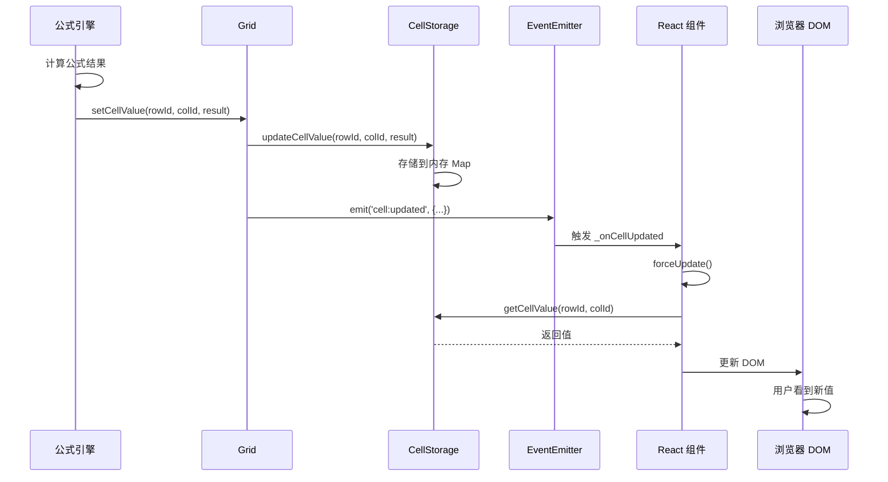

# Coda 公式系统深度分析（从实际代码）

## 📋 目录

1. [公式依赖关系的建立](#1-公式依赖关系的建立)
2. [公式值的触发和修改机制](#2-公式值的触发和修改机制)
3. [公式的表达方式](#3-公式的表达方式)
4. [公式如何修改 Slate 的值](#4-公式如何修改-slate-的值)

---

## 1. 公式依赖关系的建立

### 1.1 依赖图核心数据结构

**文件位置**: `browser.6611b23ea80de0482abc.entry.js`

```javascript
/**
 * DependencyGraph - 依赖图管理核心
 */
class DependencyGraph {
  constructor(resolver) {
    this._resolver = resolver;
    
    // 前向引用：记录"我依赖谁"
    this.forwardReferences = new Map();  // Map<fromRef, Set<toRef>>
    
    // 后向引用：记录"谁依赖我"
    this.backReferences = new Map();     // Map<toRef, Set<fromRef>>
    
    this._generation = 0;  // 依赖图版本号
  }
  
  /**
   * 添加依赖关系的核心方法
   */
  addDependency(fromRef, toRef, options) {
    const { 
      dependencyType,     // DATA | LIFECYCLE | SCHEMA
      context, 
      forceInAsync = false 
    } = options;
    
    // 如果是数据依赖且文档被黑洞化，不添加
    if (dependencyType === DependencyType.DATA && 
        this._resolver.isBlackholedDocument({ forceInAsync })) {
      return;
    }
    
    // 更新依赖图版本
    this._updateGeneration();
    
    // 创建依赖链接
    this._addLink(fromRef, toRef, dependencyType, context);
  }
  
  /**
   * 添加数据依赖（最常用）
   */
  addDataDependency(fromRef, toRef, context, { forceInAsync = false } = {}) {
    this.addDependency(fromRef, toRef, {
      dependencyType: DependencyType.DATA,
      context,
      forceInAsync
    });
  }
  
  /**
   * 内部方法：添加链接
   */
  _addLink(fromRef, toRef, dependencyType, context) {
    // 1. 规范化引用
    const normalizedFrom = Reference.fromReference(fromRef, { stripIdentifier: true });
    const normalizedTo = Reference.fromReference(toRef, { stripIdentifier: true });
    
    // 2. 添加到前向引用
    if (!this.forwardReferences.has(normalizedFrom)) {
      this.forwardReferences.set(normalizedFrom, new Set());
    }
    this.forwardReferences.get(normalizedFrom).add({
      ref: normalizedTo,
      type: dependencyType,
      context
    });
    
    // 3. 添加到后向引用
    if (!this.backReferences.has(normalizedTo)) {
      this.backReferences.set(normalizedTo, new Set());
    }
    this.backReferences.get(normalizedTo).add({
      ref: normalizedFrom,
      type: dependencyType,
      context
    });
  }
}
```

### 1.2 依赖类型枚举

**文件位置**: `browser.6611b23ea80de0482abc.entry.js`

```javascript
/**
 * 依赖类型
 */
const DependencyType = {
  DATA: 'DATA',           // 数据依赖（最常见）
  LIFECYCLE: 'LIFECYCLE', // 生命周期依赖
  SCHEMA: 'SCHEMA'        // 模式/结构依赖
};
```

### 1.3 实际依赖建立示例

**文件位置**: `browser.6611b23ea80de0482abc.entry.js`

#### 示例 1: 列公式依赖建立

```javascript
/**
 * 当公式列被创建或修改时，建立依赖关系
 * 例如: Column C 的公式是 "A + B"
 */
class Column {
  setFormula(formula, context) {
    const { dependencyGraph } = this.grid.document.session.resolver;
    
    // 1. 解析公式，提取依赖
    const parsedFormula = this._parseFormula(formula);
    const dependencies = this._extractDependencies(parsedFormula);
    
    // dependencies = [
    //   { type: 'ColumnReference', objectId: gridId, fieldId: 'col-A' },
    //   { type: 'ColumnReference', objectId: gridId, fieldId: 'col-B' }
    // ]
    
    // 2. 为每个单元格建立依赖
    const columnRef = this.getReference(); // Column C 的引用
    
    dependencies.forEach(dep => {
      // 建立依赖：Column C -> Column A
      // 建立依赖：Column C -> Column B
      dependencyGraph.addDataDependency(
        columnRef,
        dep,
        context
      );
    });
  }
}
```

#### 示例 2: Canvas Formula 依赖建立

**文件位置**: `browser.6611b23ea80de0482abc.entry.js`

```javascript
/**
 * Canvas 上的公式块（InlineCollaborativeObject）
 * 例如: =Sum(Table1.Column1)
 */
class CanvasFormulaBlock {
  bindFormula(formula) {
    const { dependencyGraph } = this.document.session.resolver;
    
    // 1. 解析公式
    const ast = this._parser.parse(formula);
    
    // 2. 提取依赖
    const dependencies = this._extractDependencies(ast);
    // dependencies = [
    //   { type: 'ColumnReference', objectId: 'table-1', fieldId: 'col-1' }
    // ]
    
    // 3. 建立依赖
    const controlRef = this.getReference();
    
    dependencies.forEach(dep => {
      dependencyGraph.addDataDependency(
        controlRef,  // 公式块
        dep,         // Table1.Column1
        {
          callback: (event) => {
            // 当 Table1.Column1 变化时，重新计算此公式
            this.invalidate(event);
          }
        }
      );
    });
  }
}
```

### 1.4 依赖上下文（Context）

**文件位置**: `browser.6611b23ea80de0482abc.entry.js`

```javascript
/**
 * 依赖上下文包含回调和额外信息
 */
const dependencyContext = {
  // 失效回调
  callback: (event) => {
    // event 包含：
    // - rowId: 哪一行变化了
    // - columnId: 哪一列变化了
    // - type: 变化类型
    
    // 执行失效逻辑
    invalidationBuilder.addDependencyForInvalidation(
      Reference.fromReference(ref),
      { rowId: event.rowId }
    );
  },
  
  // 表存储失效上下文
  tableStorage: {
    invalidateValueContext: true
  }
};
```

### 1.5 查询依赖关系

**文件位置**: `browser.6611b23ea80de0482abc.entry.js`

```javascript
/**
 * 获取后向依赖（谁依赖我）
 */
getBackDependencies(ref, options = {}) {
  const { 
    excludeStrippedIdentifierDependencies = false,
    excludeDeletedDependencies = false 
  } = options;
  
  // 1. 规范化引用（去掉标识符）
  const strippedRef = Reference.fromReference(ref, { stripIdentifier: true });
  
  // 2. 同时获取带标识符和不带标识符的依赖
  const fullRef = Reference.fromReference(ref, { stripIdentifier: false });
  
  const dependencies = new Set();
  
  // 3. 从 backReferences 获取
  const strippedDeps = this.backReferences.get(strippedRef) || [];
  const fullDeps = this.backReferences.get(fullRef) || [];
  
  // 4. 合并
  [...strippedDeps, ...fullDeps].forEach(dep => {
    // 过滤已删除的依赖
    if (excludeDeletedDependencies && this._resolver.isDeleted(dep.ref)) {
      return;
    }
    
    dependencies.add(dep);
  });
  
  return Array.from(dependencies);
}

/**
 * 获取前向依赖（我依赖谁）
 */
getForwardDependencies(ref) {
  const normalizedRef = Reference.fromReference(ref, { stripIdentifier: true });
  return this.forwardReferences.get(normalizedRef) || [];
}
```

---

## 2. 公式值的触发和修改机制

### 2.1 失效队列系统

**文件位置**: `browser.6611b23ea80de0482abc.entry.js`

```javascript
/**
 * InvalidationBuilder - 失效构建器
 */
class InvalidationBuilder {
  constructor(resolver) {
    this._resolver = resolver;
    this._queueForInvalidation = [];  // 待失效队列
    this._inflightGraph = null;       // 正在处理的失效图
    this._isProcessing = false;
  }
  
  /**
   * 添加依赖到失效队列
   */
  addDependencyForInvalidation(
    ref,
    {
      manualRefreshTimestampMs = 0,
      requiredInvalidation = true,
      manualInvalidation = true,
      skipColumnInvalidationRowFanout = false,
      dependency,
      rowId = ''
    } = {}
  ) {
    // 1. 创建失效请求
    const invalidationRequest = {
      ref,
      rowId,
      timestamp: Date.now(),
      requiredInvalidation,
      manualInvalidation,
      skipColumnInvalidationRowFanout,
      dependency
    };
    
    // 2. 加入队列
    this._enqueueInvalidation(invalidationRequest);
  }
  
  /**
   * 将失效请求加入队列
   */
  _enqueueInvalidation(request) {
    // 如果当前有正在处理的失效图，且应该优先处理
    if (this._shouldPrioritizeInInflightGraph(request)) {
      this._addAsyncCallbackToInflightGraph(request);
    } else {
      // 加入待处理队列
      this._queueForInvalidation.push(request);
      
      // 尝试处理队列
      this._tryInvalidateGraph();
    }
  }
  
  /**
   * 尝试处理失效图
   */
  _tryInvalidateGraph() {
    // 1. 防止重复处理
    if (this._queueForInvalidationProcessing || 
        this.isPaused || 
        this._inflightGraph) {
      return;
    }
    
    // 2. 取出队列中的请求
    const requests = this._queueForInvalidation;
    this._queueForInvalidation = [];
    
    if (requests.length === 0) {
      return;
    }
    
    // 3. 构建失效图
    const invalidationGraph = this._buildInvalidationGraph(requests);
    
    // 4. 标记为正在处理
    this._inflightGraph = invalidationGraph;
    
    // 5. 遍历失效图，执行重算
    this._processInvalidationGraph(invalidationGraph);
  }
  
  /**
   * 构建失效图
   */
  _buildInvalidationGraph(requests) {
    const graph = new InvalidationGraph();
    
    requests.forEach(request => {
      // 1. 添加根节点
      graph.addRootNode(request.ref, {
        rowId: request.rowId,
        requiredInvalidation: request.requiredInvalidation
      });
      
      // 2. 递归添加依赖节点
      this._exploreNode(graph, request.ref, request.rowId);
    });
    
    return graph;
  }
  
  /**
   * 递归探索依赖节点
   */
  _exploreNode(graph, ref, rowId) {
    // 1. 获取后向依赖（谁依赖这个节点）
    const backDeps = this._resolver.dependencyGraph.getBackDependencies(ref);
    
    backDeps.forEach(backDep => {
      // 2. 添加依赖节点到失效图
      const depNode = graph.addNode(backDep.ref, {
        rowId: backDep.context?.rowId || rowId,
        parent: ref
      });
      
      // 3. 递归探索
      if (!graph.hasVisited(backDep.ref)) {
        this._exploreNode(graph, backDep.ref, depNode.rowId);
      }
    });
  }
  
  /**
   * 处理失效图（执行重算）
   */
  async _processInvalidationGraph(graph) {
    // 1. 拓扑排序（确保依赖顺序正确）
    const sortedNodes = graph.topologicalSort();
    
    // 2. 按顺序重算
    for (const node of sortedNodes) {
      await this._recalculateNode(node);
    }
    
    // 3. 处理完成
    this._inflightGraph = null;
    
    // 4. 触发完成事件
    this.emit('invalidation:completed', { graph });
    
    // 5. 如果队列中还有请求，继续处理
    if (this._queueForInvalidation.length > 0) {
      this._tryInvalidateGraph();
    }
  }
  
  /**
   * 重新计算单个节点
   */
  async _recalculateNode(node) {
    const { ref, rowId } = node;
    
    // 1. 获取对象
    const object = this._resolver.tryGetModel(ref.objectId);
    
    if (!object) return;
    
    // 2. 根据对象类型执行重算
    if (object.type === 'Column' && object.formula) {
      // 列公式
      await this._recalculateColumnFormula(object, rowId);
    } else if (object.type === 'Control') {
      // Canvas 公式块
      await this._recalculateControlFormula(object);
    }
  }
  
  /**
   * 重算列公式
   */
  async _recalculateColumnFormula(column, rowId) {
    const { grid } = column;
    
    if (rowId) {
      // 重算特定行
      const cellRef = column.getReference({ rowId });
      const result = await this._executeFormula(cellRef, column.formula);
      
      // 更新单元格值
      grid.setCellValue(rowId, column.id, result.value);
    } else {
      // 重算所有行
      const rowIds = grid.rows.getIds();
      
      for (const rowId of rowIds) {
        const cellRef = column.getReference({ rowId });
        const result = await this._executeFormula(cellRef, column.formula);
        
        grid.setCellValue(rowId, column.id, result.value);
      }
    }
  }
  
  /**
   * 重算 Canvas 公式块
   */
  async _recalculateControlFormula(control) {
    const result = await this._executeFormula(
      control.getReference(),
      control.formula
    );
    
    // 更新控件值
    control.setValue(result.value);
  }
}
```

### 2.2 事件监听和触发

**文件位置**: `postload.6f4c20e443c95cbdfd2e.chunk.js`

```javascript
/**
 * 监听 Grid 变化事件
 */
class FormulaComponent extends React.Component {
  componentDidMount() {
    const { grid } = this.props;
    
    // 1. 监听行更新事件
    this.listeners = {
      [Events.RowUpdated]: this._onRowUpdated,
      [Events.ColumnDependentsInvalidated]: this._onColumnInvalidated
    };
    
    // 2. 注册监听器
    Object.entries(this.listeners).forEach(([event, handler]) => {
      grid.on(event, handler);
    });
  }
  
  /**
   * 行更新事件处理
   */
  _onRowUpdated = (event) => {
    const { rowId, columnId, newValue } = event;
    
    // 触发依赖此行的公式重算
    this._forceUpdate();
  };
  
  /**
   * 列依赖失效事件处理
   */
  _onColumnInvalidated = (event) => {
    const { columnId } = event;
    
    // 触发依赖此列的公式重算
    this._forceUpdate();
  };
  
  /**
   * 强制更新（触发重新计算）
   */
  _forceUpdate = () => {
    this.setState({ refreshKey: Date.now() });
  };
  
  componentWillUnmount() {
    // 移除监听器
    const { grid } = this.props;
    Object.entries(this.listeners).forEach(([event, handler]) => {
      grid.off(event, handler);
    });
  }
}
```

### 2.3 Grid 触发失效流程

**文件位置**: `browser.6611b23ea80de0482abc.entry.js`

```javascript
/**
 * Grid 的数据变更监听器
 */
class GridInvalidationListener {
  constructor(grid, resolver) {
    this.grid = grid;
    this.resolver = resolver;
    
    // 延迟处理的行更新
    this._deferredRowUpdates = new Map();  // Map<rowId, Set<columnId>>
    this._deferredRowAdds = new Set();     // Set<rowId>
  }
  
  /**
   * 行更新事件处理
   */
  _onRowUpdated(invalidationBuilder, { id: rowId, columnIds }) {
    // 1. 记录延迟更新
    if (!this._deferredRowUpdates.has(rowId)) {
      this._deferredRowUpdates.set(rowId, new Set());
    }
    
    columnIds.forEach(colId => {
      this._deferredRowUpdates.get(rowId).add(colId);
    });
    
    // 2. 触发失效
    this._flushDeferredUpdates(invalidationBuilder);
  }
  
  /**
   * 刷新延迟更新
   */
  _flushDeferredUpdates(invalidationBuilder) {
    // 遍历所有延迟更新的行
    for (const [rowId, columnIds] of this._deferredRowUpdates.entries()) {
      for (const columnId of columnIds) {
        const column = this.grid.columns.tryGetById(columnId);
        
        if (!column) continue;
        
        if (column.formula) {
          // 如果是公式列，失效引用
          const cellRef = column.getReference({ rowId });
          this.resolver.invalidateReference(
            invalidationBuilder,
            cellRef
          );
        } else {
          // 普通列，添加依赖失效
          const cellRef = column.getReference({ rowId });
          
          invalidationBuilder.addDependencyForInvalidation(
            Reference.fromReference(cellRef),
            { rowId }
          );
        }
      }
    }
    
    // 清空延迟队列
    this._deferredRowUpdates.clear();
  }
}
```

---

## 3. 公式的表达方式

### 3.1 公式的存储形式

**文件位置**: `browser.6611b23ea80de0482abc.entry.js`

#### 形式 1: 列公式存储

```javascript
/**
 * Column 对象中的公式存储
 */
class Column {
  // 公式文本
  formula: string;  // 例如: "A + B"
  
  // 已解析的公式（缓存）
  _parsedFormula: FormulaAST | null;
  
  // 公式错误
  formulaError: Error | null;
  
  /**
   * 实际存储示例
   */
  toJSON() {
    return {
      id: "c-abc123",
      name: "Total",
      type: "Number",
      formula: "[Price] * [Quantity]",  // 公式文本
      // ... 其他属性
    };
  }
}
```

#### 形式 2: Canvas 公式块存储

**文件位置**: `browser.6611b23ea80de0482abc.entry.js`

```javascript
/**
 * InlineCollaborativeObject - Canvas 上的公式块
 */
class ControlGrid {
  // Control ID
  id: string;  // 例如: "ctrl-formula-123"
  
  // 控件类型
  controlType: string;  // "Formula"
  
  // 公式文本（存储在特殊列中）
  columns: [
    {
      id: "col-formula",
      name: "Formula",
      value: "Sum(Table1.Column1)"  // 公式文本
    },
    {
      id: "col-result",
      name: "Result",
      value: 150  // 计算结果
    }
  ]
}
```

#### 形式 3: Slate 中的引用

**文件位置**: `browser.6611b23ea80de0482abc.entry.js`

```javascript
/**
 * Slate Block Tree 中的公式块节点
 */
{
  type: "InlineCollaborativeObject",
  id: "ctrl-formula-123",  // 引用 ControlGrid 的 ID
  children: [{ text: "" }]
}

// Slate 只存储引用（id），实际公式存储在 ControlGrid 中
```

### 3.2 公式文本格式

**文件位置**: `postload.6f4c20e443c95cbdfd2e.chunk.js`

```javascript
/**
 * Coda 公式文本示例
 */
const formulaExamples = {
  // 1. 简单引用
  simple: "[Column1] + [Column2]",
  
  // 2. 表引用
  tableRef: "Table1.Column1.Sum()",
  
  // 3. thisRow 引用
  thisRow: "thisRow.[Price] * thisRow.[Quantity]",
  
  // 4. 函数调用
  function: "Sum([Column1], [Column2], [Column3])",
  
  // 5. 条件表达式
  conditional: "If([Status] = \"Done\", \"Complete\", \"Pending\")",
  
  // 6. 列表操作
  list: "List(1, 2, 3).Sort(True())",
  
  // 7. 链式调用
  chain: "Table1.Filter([Active] = True()).Column1.Sum()",
  
  // 8. 对象引用
  objectRef: "$$[grid:table-123:c-abc::false:false:Column Name]",
  
  // 9. Pack 公式
  pack: "Pack1.GetData(\"param\")",
  
  // 10. 排序
  sorted: "Table1.Column1.Unique().Sort(True())"
};
```

### 3.3 引用对象的序列化格式

**文件位置**: `browser.6611b23ea80de0482abc.entry.js`

```javascript
/**
 * 对象引用的序列化格式
 * $$[type:objectId:fieldId:identifier:locked:deleted:displayName]
 */
const referenceFormat = {
  // Grid 引用
  grid: "$$[grid:table-GPDECroKmX:::false:false:My Table]",
  
  // Column 引用
  column: "$$[column:table-GPDECroKmX:c-abc123::false:false:Column Name]",
  
  // Row 引用
  row: "$$[row:table-GPDECroKmX::r-xyz789:false:false:Row 1]",
  
  // Cell 引用
  cell: "$$[cell:table-GPDECroKmX:c-abc123:r-xyz789:false:false:Cell A1]",
  
  // Canvas 引用
  canvas: "$$[canvas:canvas-001:::false:false:Page 1]"
};
```

### 3.4 公式 AST 结构

**文件位置**: `browser.6611b23ea80de0482abc.entry.js`

```javascript
/**
 * FormulaAST - 抽象语法树
 */
type FormulaAST = 
  | LiteralNode
  | ReferenceNode
  | BinaryOpNode
  | FunctionCallNode
  | MemberAccessNode;

/**
 * 字面量节点
 */
interface LiteralNode {
  type: 'Literal';
  valueType: 'Number' | 'String' | 'Boolean';
  value: number | string | boolean;
}

/**
 * 引用节点
 */
interface ReferenceNode {
  type: 'Reference';
  objectId: string;       // 'table-123'
  fieldId?: string;       // 'c-abc'
  identifier?: string;    // 'r-xyz'
  displayName: string;    // 'Column Name'
}

/**
 * 二元操作节点
 */
interface BinaryOpNode {
  type: 'BinaryOp';
  operator: '+' | '-' | '*' | '/' | '=' | '!=' | '>' | '<';
  left: FormulaAST;
  right: FormulaAST;
}

/**
 * 函数调用节点
 */
interface FunctionCallNode {
  type: 'FunctionCall';
  functionName: string;     // 'Sum', 'If', 'List'
  arguments: FormulaAST[];
}

/**
 * 成员访问节点
 */
interface MemberAccessNode {
  type: 'MemberAccess';
  object: FormulaAST;       // Table1
  property: string;         // 'Column1'
}

/**
 * 示例 AST
 * 公式: "Table1.Column1.Sum() + 10"
 */
const exampleAST = {
  type: 'BinaryOp',
  operator: '+',
  left: {
    type: 'FunctionCall',
    functionName: 'Sum',
    arguments: [],
    callee: {
      type: 'MemberAccess',
      object: {
        type: 'Reference',
        objectId: 'table-1',
        displayName: 'Table1'
      },
      property: 'Column1'
    }
  },
  right: {
    type: 'Literal',
    valueType: 'Number',
    value: 10
  }
};
```

---

## 4. 公式如何修改 Slate 的值

### 4.1 公式结果更新到 Slate

**公式不直接修改 Slate 的值！**

**关键理解**：
- **Canvas 公式块**：公式结果存储在 `ControlGrid` 中，Slate 只存储引用
- **列公式**：结果存储在 `Grid.cellStorage` 中，与 Slate 无关

**文件位置**: `browser.6611b23ea80de0482abc.entry.js`

```javascript
/**
 * Canvas 公式块的值更新流程
 */
class ControlGrid {
  /**
   * 更新公式结果
   */
  setFormulaResult(result) {
    // 1. 获取结果列
    const resultColumn = this.columns.getById('col-result');
    
    // 2. 获取或创建行
    const rowId = this.rows.getIds()[0] || this._createRow();
    
    // 3. 更新单元格值（存储在 CellStorage 中）
    this.cellStorage.updateCellValue(
      rowId,
      resultColumn.id,
      result.value
    );
    
    // 4. 触发事件（通知 React 组件更新）
    this.emit('value:changed', {
      rowId,
      columnId: resultColumn.id,
      newValue: result.value
    });
  }
}
```

### 4.2 Slate 组件渲染公式结果

**文件位置**: `postload.6f4c20e443c95cbdfd2e.chunk.js`

```javascript
/**
 * InlineCollaborativeObject 渲染器
 */
class FormulaBlockRenderer extends React.Component {
  render() {
    const { node } = this.props;  // Slate 节点
    
    // 1. 从 Slate 节点获取 Control ID
    const controlId = node.id;  // "ctrl-formula-123"
    
    // 2. 通过 Resolver 获取 ControlGrid
    const control = this.props.document.session.resolver
      .typedGetters
      .tryGetControlGrid(controlId);
    
    if (!control) {
      return <div>Formula not found</div>;
    }
    
    // 3. 从 ControlGrid 读取结果
    const resultColumn = control.columns.getById('col-result');
    const rowId = control.rows.getIds()[0];
    const result = control.getCellValue(rowId, resultColumn.id);
    
    // 4. 渲染结果
    return (
      <div className="formula-block">
        <div className="formula-result">
          {this.formatValue(result)}
        </div>
      </div>
    );
  }
  
  /**
   * 监听值变化
   */
  componentDidMount() {
    const control = this._getControl();
    
    // 监听值变化事件
    control.on('value:changed', this._onValueChanged);
  }
  
  _onValueChanged = (event) => {
    // 触发 React 重新渲染
    this.forceUpdate();
  };
}
```

### 4.3 列公式结果更新

**文件位置**: `browser.6611b23ea80de0482abc.entry.js`

```javascript
/**
 * 列公式结果存储到 CellStorage
 */
class Grid {
  /**
   * 设置单元格值
   */
  setCellValue(rowId, columnId, value) {
    // 1. 规范化值
    const normalizedValue = this._normalizeValue(value);
    
    // 2. 更新 CellStorage
    this.cellStorage.updateCellValue(
      rowId,
      columnId,
      normalizedValue
    );
    
    // 3. 触发事件
    this.emit('cell:updated', {
      rowId,
      columnId,
      newValue: normalizedValue
    });
    
    // 4. 触发依赖失效
    this._triggerDependentInvalidation(rowId, columnId);
  }
  
  /**
   * 触发依赖失效
   */
  _triggerDependentInvalidation(rowId, columnId) {
    const column = this.columns.getById(columnId);
    const cellRef = column.getReference({ rowId });
    
    // 创建失效构建器
    const invalidationBuilder = this.document.session.resolver
      .createInvalidationBuilder();
    
    // 添加依赖失效
    invalidationBuilder.addDependencyForInvalidation(
      Reference.fromReference(cellRef),
      { rowId }
    );
    
    // 构建并处理失效图
    invalidationBuilder.build();
  }
}
```

### 4.4 CellStorage 结构

**文件位置**: `browser.6611b23ea80de0482abc.entry.js`

```javascript
/**
 * CellStorage - 单元格存储
 */
class CellStorage {
  constructor() {
    // 存储结构：Map<rowId, Map<columnId, CellValue>>
    this._storage = new Map();
  }
  
  /**
   * 更新单元格值
   */
  updateCellValue(rowId, columnId, value) {
    // 1. 确保行存在
    if (!this._storage.has(rowId)) {
      this._storage.set(rowId, new Map());
    }
    
    // 2. 获取单元格读取器
    const { reader } = this._getCellBufferReader(rowId, columnId);
    
    // 3. 规范化值
    const normalizedValue = this._normalizeValue(value);
    
    // 4. 写入单元格
    this._writeCellValueAndError(reader, normalizedValue, null);
    
    // 5. 标记为脏（需要持久化）
    this._markDirty(rowId, columnId);
  }
  
  /**
   * 读取单元格值
   */
  getCellValue(rowId, columnId) {
    const rowData = this._storage.get(rowId);
    if (!rowData) return undefined;
    
    const cellData = rowData.get(columnId);
    return cellData?.value;
  }
  
  /**
   * 实际存储格式
   */
  _storage = new Map([
    ['r-1', new Map([
      ['c-A', { value: 10, error: null, isDirty: false }],
      ['c-B', { value: 20, error: null, isDirty: false }],
      ['c-C', { value: 30, error: null, isDirty: true }]  // 公式结果
    ])],
    ['r-2', new Map([
      ['c-A', { value: 5, error: null, isDirty: false }],
      ['c-B', { value: 15, error: null, isDirty: false }],
      ['c-C', { value: 20, error: null, isDirty: true }]  // 公式结果
    ])]
  ]);
}
```

### 4.5 Slate 表格单元格渲染

**文件位置**: `postload.6f4c20e443c95cbdfd2e.chunk.js`

```javascript
/**
 * 表格单元格组件
 */
class TableCellComponent extends React.Component {
  render() {
    const { grid, row, column } = this.props;
    
    // 1. 从 CellStorage 读取值
    const cellValue = grid.getCellValue(row.id, column.id);
    
    // 2. 格式化显示
    const displayValue = this.formatCellValue(cellValue, column.type);
    
    // 3. 渲染
    return (
      <div className="table-cell">
        {column.formula && (
          <div className="formula-indicator">ƒ</div>
        )}
        <div className="cell-value">
          {displayValue}
        </div>
      </div>
    );
  }
  
  /**
   * 监听单元格变化
   */
  componentDidMount() {
    const { grid, row, column } = this.props;
    
    // 监听单元格更新事件
    grid.on('cell:updated', this._onCellUpdated);
  }
  
  _onCellUpdated = (event) => {
    const { row, column } = this.props;
    
    // 如果是当前单元格，重新渲染
    if (event.rowId === row.id && event.columnId === column.id) {
      this.forceUpdate();
    }
  };
}
```

### 4.6 完整的值更新流程



---

## 📊 总结

### 核心要点

1. **依赖关系建立**：
   - 使用 `DependencyGraph` 维护双向引用（forward + backward）
   - 通过 `addDataDependency()` 建立数据依赖
   - 支持三种依赖类型：DATA、LIFECYCLE、SCHEMA

2. **值触发机制**：
   - 使用失效队列系统（`InvalidationBuilder`）
   - 构建失效图（`InvalidationGraph`）并拓扑排序
   - 递归遍历依赖树，触发重算

3. **公式表达**：
   - 文本形式：`"[Column1] + [Column2]"`
   - 引用序列化：`$$[type:objectId:fieldId:...]`
   - AST 形式：树状结构表示语法

4. **Slate 值更新**：
   - **公式不直接修改 Slate**
   - 结果存储在 `CellStorage` 或 `ControlGrid` 中
   - Slate 只存储引用，React 组件从存储读取并渲染

### 数据流向

```
用户输入数据
    ↓
Grid.setCellValue()
    ↓
CellStorage.updateCellValue()
    ↓
触发 'cell:updated' 事件
    ↓
InvalidationBuilder.addDependencyForInvalidation()
    ↓
构建失效图
    ↓
遍历失效图，执行重算
    ↓
更新依赖公式的结果
    ↓
触发 React 组件更新
    ↓
从 CellStorage 读取新值
    ↓
更新 DOM，用户看到变化
```

---

**文档创建时间**: 2025-10-16

**相关文档**:
- `formula.md` - 公式系统基础分析
- `dependency_and_invalidation_graphs.md` - 依赖图和失效图详解
- `06_formula_engine_deep_dive.md` - 公式引擎深度分析
