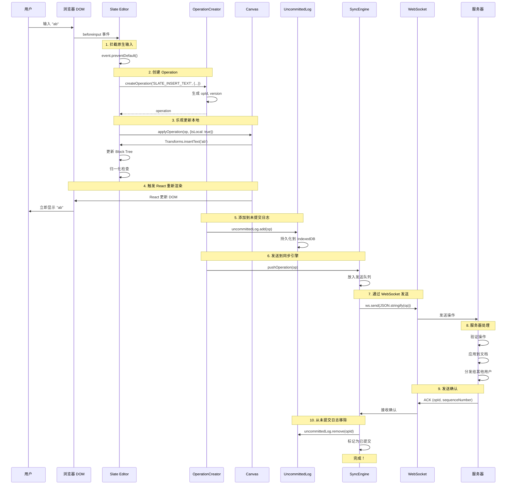

# Coda 文本输入到同步的完整流程

## 🎯 场景说明

用户在 Coda 文档中输入两个文字 "ab"，这个过程是如何：
1. 形成 Operation
2. 在本地执行
3. 发送到远端的？

---

## 📊 完整流程图



---

## 🔍 详细步骤分析

### Step 1: 用户输入捕获

#### 1.1 浏览器事件

**文件位置**: `browser.6611b23ea80de0482abc.entry.js`

```javascript
/**
 * Slate 监听浏览器的 beforeinput 事件
 */
element.addEventListener('beforeinput', (event) => {
  // 阻止浏览器默认行为
  event.preventDefault();
  
  const { inputType, data } = event;
  
  // inputType: 'insertText'
  // data: 'ab'
  
  handleBeforeInput(event, editor);
});

/**
 * 处理输入事件
 */
function handleBeforeInput(event, editor) {
  const { inputType, data } = event;
  
  switch (inputType) {
    case 'insertText':
      // 用户输入文本
      if (data) {
        insertText(editor, data);  // data = 'ab'
      }
      break;
      
    case 'insertLineBreak':
      // 用户按 Enter
      insertBreak(editor);
      break;
      
    case 'deleteContentBackward':
      // 用户按 Backspace
      deleteBackward(editor);
      break;
      
    // ... 其他输入类型
  }
}
```

#### 1.2 为什么要拦截？

```javascript
// ❌ 如果不拦截
// 浏览器会直接修改 contentEditable 的 DOM
// 这会绕过 Slate 的控制，导致状态不一致

// ✅ Coda 的做法
// 1. preventDefault() 阻止浏览器默认行为
// 2. 通过 Slate 的 API 更新状态
// 3. React 根据新状态重新渲染 DOM
// 4. 同时创建 Operation 用于同步
```

---

### Step 2: 创建 Operation

**文件位置**: `postload.6f4c20e443c95cbdfd2e.chunk.js`

```javascript
/**
 * 插入文本
 */
function insertText(editor, text) {
  const { selection } = editor;
  if (!selection) return;
  
  // 1. 获取当前光标位置
  const { anchor } = selection;
  // anchor = { path: [0, 0], offset: 5 }
  
  // 2. 创建 Operation
  const operation = editor.document.uncommittedOperationCreator.createOperation(
    'SLATE_INSERT_TEXT',  // 操作类型
    {
      canvasId: editor.canvas.id,      // 'canvas-001'
      path: anchor.path,                 // [0, 0]
      offset: anchor.offset,             // 5
      text: text,                        // 'ab'
      timestamp: Date.now(),
      userId: editor.document.session.user.userId
    }
  );
  
  // operation 结构：
  // {
  //   type: 'SLATE_INSERT_TEXT',
  //   opId: 'op-abc123',              // 唯一 ID
  //   version: 42,                    // 文档版本号
  //   sequenceNumber: 100,            // 操作序号
  //   userId: 'user-001',
  //   timestamp: 1697500000000,
  //   data: {
  //     canvasId: 'canvas-001',
  //     path: [0, 0],
  //     offset: 5,
  //     text: 'ab'
  //   }
  // }
  
  // 3. 乐观更新本地
  Transforms.insertText(editor, text);
  
  // 4. 发送到同步引擎
  editor.document.syncEngine.pushOperation(operation);
}
```

#### 2.1 UncommittedOperationCreator 实现

**文件位置**: `browser.6611b23ea80de0482abc.entry.js`

```javascript
/**
 * Operation Creator - 创建操作
 */
class UncommittedOperationCreator {
  constructor(document) {
    this._document = document;
    this._nextSequenceNumber = 1;
  }
  
  /**
   * 创建操作
   */
  createOperation(type, data, options = {}) {
    const { version, sequenceNumber, opId } = this._generateIds();
    
    const operation = {
      type,                                      // 'SLATE_INSERT_TEXT'
      opId,                                      // 唯一 ID
      version,                                   // 当前文档版本 + 1
      sequenceNumber,                            // 操作序号
      userId: this._document.session.user.userId,
      timestamp: Date.now(),
      data,                                      // 操作数据
      ...options
    };
    
    return operation;
  }
  
  /**
   * 生成 ID 和版本号
   */
  _generateIds() {
    return {
      opId: `op-${generateUniqueId()}`,        // 'op-abc123'
      version: this._document.currentVersion + 1,
      sequenceNumber: this._nextSequenceNumber++
    };
  }
  
  /**
   * 包装操作源
   */
  withOperationSource(source, fn) {
    const prevSource = this.operationSource;
    this.operationSource = source;
    
    try {
      return fn();
    } finally {
      this.operationSource = prevSource;
    }
  }
  
  /**
   * 包装意图（用于撤销/重做）
   */
  withIntent(intentType, intentData, fn) {
    const intent = this.createIntent(intentType, intentData);
    
    return this.withOperationSource(intent, fn);
  }
}
```

---

### Step 3: 乐观更新本地

**文件位置**: `browser.6611b23ea80de0482abc.entry.js`

```javascript
/**
 * 应用 Operation 到本地
 */
class DocumentModel {
  applyOperation(operation, options = {}) {
    const { isLocal = false } = options;
    
    // 1. 根据操作类型分发
    switch (operation.type) {
      case 'SLATE_INSERT_TEXT':
        this._applySlateInsertText(operation);
        break;
        
      case 'SLATE_REMOVE_TEXT':
        this._applySlateRemoveText(operation);
        break;
        
      case 'SLATE_INSERT_NODE':
        this._applySlateInsertNode(operation);
        break;
        
      // ... 其他操作类型
    }
    
    // 2. 更新文档版本
    if (!isLocal) {
      this.currentVersion = operation.version;
    }
    
    // 3. 触发事件
    this.emit('operation:applied', operation);
  }
  
  /**
   * 应用插入文本操作
   */
  _applySlateInsertText(operation) {
    const { canvasId, path, offset, text } = operation.data;
    
    // 1. 获取 Canvas
    const canvas = this.session.resolver.typedGetters.getPageCanvas(canvasId);
    
    // 2. 在归一化批次中执行
    canvas.slate.inNormalizationBatch((editor) => {
      // 3. 插入文本
      Transforms.insertText(editor, text, {
        at: { path, offset }
      });
      
      // 4. Slate 自动归一化
      // 5. 更新选区
      const newOffset = offset + text.length;
      Transforms.select(editor, {
        anchor: { path, offset: newOffset },
        focus: { path, offset: newOffset }
      });
    });
    
    // 6. 触发 Canvas 变更事件
    canvas.emit('slate:changed');
  }
}
```

#### 3.1 Slate Transforms.insertText 实现

```javascript
/**
 * Slate 的 Transforms.insertText
 */
Transforms.insertText = (editor, text, options = {}) => {
  const { at = editor.selection } = options;
  
  if (!at) return;
  
  // 1. 定位到目标位置
  const [node, path] = Editor.node(editor, at.path);
  
  // 2. 插入文本
  const offset = at.offset;
  const newText = 
    node.text.slice(0, offset) + 
    text + 
    node.text.slice(offset);
  
  // 3. 更新节点
  const newNode = { ...node, text: newText };
  
  // 4. 应用到编辑器
  editor.children = updateNodeAtPath(editor.children, path, newNode);
  
  // 5. 触发 onChange
  editor.onChange();
};
```

---

### Step 4: 添加到未提交日志

**文件位置**: `browser.6611b23ea80de0482abc.entry.js`

```javascript
/**
 * UncommittedLog - 未提交操作日志
 */
class UncommittedLog {
  constructor(userId, options = {}) {
    this._userId = userId;
    this._operations = [];  // 内存中的操作
    this._idbLog = null;    // IndexedDB 持久化
    
    if (options.enableLogging) {
      this._idbLog = new IndexedDBLog({
        dbName: 'coda-uncommitted-ops',
        storeName: 'operations'
      });
    }
  }
  
  /**
   * 初始化（从 IndexedDB 恢复）
   */
  async init() {
    if (this._idbLog) {
      await this._idbLog.init();
      
      // 恢复未提交的操作
      const storedOps = await this._idbLog.fetchAll();
      this._operations = storedOps;
    }
  }
  
  /**
   * 添加操作
   */
  add(operation) {
    // 1. 添加到内存
    this._operations.push(operation);
    
    // 2. 持久化到 IndexedDB
    if (this._idbLog) {
      this._idbLog.add(operation).catch(err => {
        console.error('Failed to persist operation:', err);
      });
    }
    
    // 3. 触发事件
    this.emit('operation:added', operation);
  }
  
  /**
   * 移除操作（收到服务器确认后）
   */
  remove(opId) {
    // 1. 从内存中移除
    const index = this._operations.findIndex(op => op.opId === opId);
    if (index !== -1) {
      this._operations.splice(index, 1);
    }
    
    // 2. 从 IndexedDB 中删除
    if (this._idbLog) {
      this._idbLog.remove(opId);
    }
    
    // 3. 触发事件
    this.emit('operation:removed', opId);
  }
  
  /**
   * 获取所有未提交操作
   */
  fetchAll() {
    return [...this._operations];
  }
  
  /**
   * 获取第一个未提交操作
   */
  fetchFirst() {
    return this._operations[0] || null;
  }
  
  /**
   * 获取最后一个未提交操作
   */
  fetchLast() {
    return this._operations[this._operations.length - 1] || null;
  }
  
  /**
   * 更新操作（OT 转换后）
   */
  update(opId, newOperation) {
    const index = this._operations.findIndex(op => op.opId === opId);
    if (index !== -1) {
      this._operations[index] = newOperation;
      
      if (this._idbLog) {
        this._idbLog.update(opId, newOperation);
      }
    }
  }
  
  /**
   * 获取未提交操作数量
   */
  get length() {
    return this._operations.length;
  }
}
```

#### 4.1 IndexedDB 持久化

```javascript
/**
 * IndexedDB 存储（确保刷新页面后不丢失）
 */
class IndexedDBLog {
  constructor(config) {
    this._dbName = config.dbName;
    this._storeName = config.storeName;
    this._db = null;
  }
  
  async init() {
    return new Promise((resolve, reject) => {
      const request = indexedDB.open(this._dbName, 1);
      
      request.onupgradeneeded = (event) => {
        const db = event.target.result;
        
        // 创建 object store
        if (!db.objectStoreNames.contains(this._storeName)) {
          db.createObjectStore(this._storeName, { keyPath: 'opId' });
        }
      };
      
      request.onsuccess = (event) => {
        this._db = event.target.result;
        resolve();
      };
      
      request.onerror = () => reject(request.error);
    });
  }
  
  async add(operation) {
    const transaction = this._db.transaction([this._storeName], 'readwrite');
    const store = transaction.objectStore(this._storeName);
    
    return new Promise((resolve, reject) => {
      const request = store.add(operation);
      request.onsuccess = () => resolve();
      request.onerror = () => reject(request.error);
    });
  }
  
  async remove(opId) {
    const transaction = this._db.transaction([this._storeName], 'readwrite');
    const store = transaction.objectStore(this._storeName);
    
    return new Promise((resolve, reject) => {
      const request = store.delete(opId);
      request.onsuccess = () => resolve();
      request.onerror = () => reject(request.error);
    });
  }
  
  async fetchAll() {
    const transaction = this._db.transaction([this._storeName], 'readonly');
    const store = transaction.objectStore(this._storeName);
    
    return new Promise((resolve, reject) => {
      const request = store.getAll();
      request.onsuccess = () => resolve(request.result);
      request.onerror = () => reject(request.error);
    });
  }
}
```

---

### Step 5: 发送到同步引擎

**文件位置**: `browser.6611b23ea80de0482abc.entry.js`

```javascript
/**
 * SyncEngine - 同步引擎
 */
class SyncEngine {
  constructor(document) {
    this._document = document;
    this._wsClient = null;
    this._sendQueue = [];
    this._inflightOps = new Map();  // 已发送但未确认的操作
    this._isTransmitting = false;
  }
  
  /**
   * 推送操作
   */
  pushOperation(operation) {
    // 1. 添加到发送队列
    this._sendQueue.push(operation);
    
    // 2. 添加到未提交日志
    this._document.uncommittedLog.add(operation);
    
    // 3. 尝试发送
    this._tryPushNextOperations();
  }
  
  /**
   * 尝试发送下一批操作
   */
  async _tryPushNextOperations() {
    // 防止重复发送
    if (this._isTransmitting) return;
    
    // 没有待发送的操作
    if (this._sendQueue.length === 0) return;
    
    // 检查网络状态
    if (!this._wsClient || !this._wsClient.isConnected) {
      console.log('WebSocket not connected, queuing operations');
      return;
    }
    
    this._isTransmitting = true;
    
    try {
      // 取出待发送的操作
      const opsToSend = this._sendQueue.splice(0, 10);  // 批量发送
      
      // 发送到服务器
      await this._sendOperations(opsToSend);
      
      // 标记为 inflight
      opsToSend.forEach(op => {
        this._inflightOps.set(op.opId, op);
      });
      
    } finally {
      this._isTransmitting = false;
      
      // 如果还有待发送的，继续发送
      if (this._sendQueue.length > 0) {
        this._tryPushNextOperations();
      }
    }
  }
  
  /**
   * 发送操作到服务器
   */
  async _sendOperations(operations) {
    // 准备发送数据
    const payload = {
      type: 'operations',
      docId: this._document.id,
      ops: operations.map(op => this._serializeOperation(op))
    };
    
    // 通过 WebSocket 发送
    this._wsClient.send(JSON.stringify(payload));
    
    console.log(`📤 Sent ${operations.length} operations:`, operations.map(op => op.opId));
  }
  
  /**
   * 序列化操作（发送前）
   */
  _serializeOperation(operation) {
    return {
      type: operation.type,
      opId: operation.opId,
      version: operation.version,
      sequenceNumber: operation.sequenceNumber,
      userId: operation.userId,
      timestamp: operation.timestamp,
      data: operation.data
    };
  }
}
```

---

### Step 6: WebSocket 发送

**文件位置**: `browser.6611b23ea80de0482abc.entry.js`

```javascript
/**
 * WebSocket 客户端
 */
class WebSocketClient {
  constructor(url) {
    this._url = url;
    this._ws = null;
    this._isConnected = false;
    this._messageHandlers = [];
  }
  
  /**
   * 连接
   */
  connect() {
    this._ws = new WebSocket(this._url);
    
    this._ws.onopen = () => {
      console.log('✅ WebSocket connected');
      this._isConnected = true;
      this.emit('connected');
    };
    
    this._ws.onmessage = (event) => {
      const message = JSON.parse(event.data);
      this._handleMessage(message);
    };
    
    this._ws.onclose = () => {
      console.log('❌ WebSocket disconnected');
      this._isConnected = false;
      this.emit('disconnected');
      
      // 自动重连
      setTimeout(() => this.connect(), 1000);
    };
    
    this._ws.onerror = (error) => {
      console.error('WebSocket error:', error);
    };
  }
  
  /**
   * 发送消息
   */
  send(data) {
    if (!this._isConnected) {
      console.warn('WebSocket not connected, cannot send');
      return;
    }
    
    this._ws.send(data);
  }
  
  /**
   * 处理接收到的消息
   */
  _handleMessage(message) {
    this._messageHandlers.forEach(handler => {
      handler(message);
    });
  }
  
  /**
   * 注册消息处理器
   */
  onMessage(handler) {
    this._messageHandlers.push(handler);
  }
  
  get isConnected() {
    return this._isConnected;
  }
}
```

---

### Step 7: 服务器处理

**服务器端伪代码**（实际在服务器运行）：

```javascript
/**
 * 服务器端处理操作
 */
class DocumentServer {
  /**
   * 接收客户端操作
   */
  async handleOperations(message, clientSocket) {
    const { docId, ops } = message;
    
    // 1. 加载文档
    const doc = await this.loadDocument(docId);
    
    // 2. 验证操作
    for (const op of ops) {
      if (!this.validateOperation(op, doc)) {
        // 发送错误
        clientSocket.send(JSON.stringify({
          type: 'error',
          opId: op.opId,
          error: 'Invalid operation'
        }));
        continue;
      }
      
      // 3. OT 转换（如果有并发操作）
      const transformedOp = await this.transformOperation(op, doc);
      
      // 4. 应用到服务器文档
      await doc.applyOperation(transformedOp);
      
      // 5. 持久化
      await this.persistOperation(docId, transformedOp);
      
      // 6. 分发给其他客户端
      this.broadcastOperation(docId, transformedOp, clientSocket);
      
      // 7. 发送确认给发送者
      clientSocket.send(JSON.stringify({
        type: 'ack',
        opId: op.opId,
        sequenceNumber: op.sequenceNumber,
        version: transformedOp.version
      }));
    }
  }
  
  /**
   * 广播操作给其他客户端
   */
  broadcastOperation(docId, operation, senderSocket) {
    const clients = this.getDocumentClients(docId);
    
    clients.forEach(client => {
      if (client !== senderSocket) {
        client.send(JSON.stringify({
          type: 'remote_operation',
          operation: operation
        }));
      }
    });
  }
}
```

---

### Step 8: 接收服务器确认

**文件位置**: `browser.6611b23ea80de0482abc.entry.js`

```javascript
/**
 * SyncEngine - 处理服务器消息
 */
class SyncEngine {
  constructor(document) {
    // ...
    
    // 监听 WebSocket 消息
    this._wsClient.onMessage((message) => {
      this._handleServerMessage(message);
    });
  }
  
  /**
   * 处理服务器消息
   */
  _handleServerMessage(message) {
    switch (message.type) {
      case 'ack':
        // 收到确认
        this._handleAck(message);
        break;
        
      case 'remote_operation':
        // 收到其他用户的操作
        this._handleRemoteOperation(message.operation);
        break;
        
      case 'error':
        // 收到错误
        this._handleError(message);
        break;
    }
  }
  
  /**
   * 处理确认消息
   */
  _handleAck(ack) {
    const { opId, sequenceNumber, version } = ack;
    
    console.log(`✅ Received ACK for operation: ${opId}`);
    
    // 1. 从 inflight 移除
    this._inflightOps.delete(opId);
    
    // 2. 从未提交日志移除
    this._document.uncommittedLog.remove(opId);
    
    // 3. 更新文档版本
    this._document.currentVersion = version;
    
    // 4. 触发事件
    this.emit('operation:committed', { opId, version });
  }
  
  /**
   * 处理远程操作
   */
  _handleRemoteOperation(operation) {
    console.log(`📥 Received remote operation:`, operation);
    
    // 1. 获取本地未提交的操作
    const uncommittedOps = this._document.uncommittedLog.fetchAll();
    
    if (uncommittedOps.length > 0) {
      // 2. 需要 OT 转换
      const result = this._transformOperations(operation, uncommittedOps);
      
      // 3. 应用转换后的远程操作
      this._document.applyOperation(result.transformedServerOp, { isLocal: false });
      
      // 4. 更新本地未提交操作
      result.transformedLocalOps.forEach((transformedOp, index) => {
        const originalOp = uncommittedOps[index];
        this._document.uncommittedLog.update(originalOp.opId, transformedOp);
      });
      
    } else {
      // 没有本地未提交操作，直接应用
      this._document.applyOperation(operation, { isLocal: false });
    }
  }
}
```

---

## 🔄 OT（Operational Transformation）转换

当存在并发编辑时，需要进行 OT 转换：

**文件位置**: `browser.6611b23ea80de0482abc.entry.js`

```javascript
/**
 * OT 转换引擎
 */
class OperationalTransformation {
  /**
   * 转换两个操作
   */
  transform(op1, op2) {
    // 根据操作类型进行转换
    if (op1.type === 'SLATE_INSERT_TEXT' && op2.type === 'SLATE_INSERT_TEXT') {
      return this._transformInsertInsert(op1, op2);
    }
    
    if (op1.type === 'SLATE_INSERT_TEXT' && op2.type === 'SLATE_REMOVE_TEXT') {
      return this._transformInsertDelete(op1, op2);
    }
    
    // ... 其他组合
  }
  
  /**
   * INSERT_TEXT vs INSERT_TEXT
   */
  _transformInsertInsert(op1, op2) {
    // 同一位置插入
    if (pathEquals(op1.data.path, op2.data.path)) {
      if (op1.data.offset < op2.data.offset) {
        // op1 在前，op2 偏移量增加
        return {
          op1Prime: op1,
          op2Prime: {
            ...op2,
            data: {
              ...op2.data,
              offset: op2.data.offset + op1.data.text.length
            }
          }
        };
      } else if (op1.data.offset > op2.data.offset) {
        // op2 在前，op1 偏移量增加
        return {
          op1Prime: {
            ...op1,
            data: {
              ...op1.data,
              offset: op1.data.offset + op2.data.text.length
            }
          },
          op2Prime: op2
        };
      } else {
        // 完全相同位置，使用 userId 或 timestamp 决定顺序
        if (op1.userId < op2.userId) {
          return {
            op1Prime: op1,
            op2Prime: {
              ...op2,
              data: {
                ...op2.data,
                offset: op2.data.offset + op1.data.text.length
              }
            }
          };
        } else {
          return {
            op1Prime: {
              ...op1,
              data: {
                ...op1.data,
                offset: op1.data.offset + op2.data.text.length
              }
            },
            op2Prime: op2
          };
        }
      }
    }
    
    // 不同位置，不需要转换
    return { op1Prime: op1, op2Prime: op2 };
  }
}
```

---

## 📊 时间线示例

假设用户在 offset=5 的位置输入 "ab"：

```
t=0ms    用户按下 'a'
t=1ms    beforeinput 事件触发
t=2ms    创建 Operation (opId: op-001, text: 'a')
t=3ms    本地应用 (Slate 更新)
t=4ms    添加到 UncommittedLog
t=5ms    React 重新渲染
t=6ms    用户看到 'a' 出现在屏幕上 ✅ (乐观更新)
t=7ms    发送 op-001 到 WebSocket

t=50ms   用户按下 'b'
t=51ms   beforeinput 事件触发
t=52ms   创建 Operation (opId: op-002, text: 'b')
t=53ms   本地应用 (Slate 更新)
t=54ms   添加到 UncommittedLog
t=55ms   React 重新渲染
t=56ms   用户看到 'ab' 出现在屏幕上 ✅ (乐观更新)
t=57ms   发送 op-002 到 WebSocket

t=100ms  服务器收到 op-001
t=101ms  服务器验证并应用
t=102ms  服务器发送 ACK (opId: op-001)
t=120ms  客户端收到 ACK
t=121ms  从 UncommittedLog 移除 op-001

t=150ms  服务器收到 op-002
t=151ms  服务器验证并应用
t=152ms  服务器发送 ACK (opId: op-002)
t=170ms  客户端收到 ACK
t=171ms  从 UncommittedLog 移除 op-002

✅ 完成！用户输入的 "ab" 已同步到服务器
```

---

## 🛠️ 调试技巧

### 1. 查看未提交操作

```javascript
/**
 * 查看当前未提交的操作
 */
function showUncommittedOperations() {
  const dm = window.coda.documentModel;
  const uncommittedOps = dm.uncommittedLog.fetchAll();
  
  console.log(`📋 未提交操作数: ${uncommittedOps.length}`);
  
  uncommittedOps.forEach((op, index) => {
    console.log(`\n${index + 1}. Operation:`);
    console.log(`   opId: ${op.opId}`);
    console.log(`   type: ${op.type}`);
    console.log(`   version: ${op.version}`);
    console.log(`   sequenceNumber: ${op.sequenceNumber}`);
    console.log(`   data:`, op.data);
  });
  
  return uncommittedOps;
}

// 使用
showUncommittedOperations();
```

### 2. 监控操作流

```javascript
/**
 * 监控操作的完整生命周期
 */
function monitorOperationFlow() {
  const dm = window.coda.documentModel;
  
  // 1. 监听操作创建
  const originalCreate = dm.uncommittedOperationCreator.createOperation;
  dm.uncommittedOperationCreator.createOperation = function(...args) {
    const op = originalCreate.apply(this, args);
    console.log('🆕 Operation Created:', op.opId, op.type);
    return op;
  };
  
  // 2. 监听添加到未提交日志
  dm.uncommittedLog.on('operation:added', (op) => {
    console.log('📝 Added to UncommittedLog:', op.opId);
  });
  
  // 3. 监听从未提交日志移除
  dm.uncommittedLog.on('operation:removed', (opId) => {
    console.log('✅ Removed from UncommittedLog:', opId);
  });
  
  // 4. 监听操作提交
  dm.syncEngine.on('operation:committed', ({ opId, version }) => {
    console.log('🎉 Operation Committed:', opId, 'version:', version);
  });
  
  console.log('✅ Monitoring started');
}

// 使用
monitorOperationFlow();
```

### 3. 查看 WebSocket 流量

```javascript
/**
 * 监控 WebSocket 发送和接收
 */
function monitorWebSocketTraffic() {
  const originalSend = WebSocket.prototype.send;
  const originalOnMessage = WebSocket.prototype.addEventListener;
  
  // 监听发送
  WebSocket.prototype.send = function(data) {
    try {
      const parsed = JSON.parse(data);
      if (parsed.type === 'operations') {
        console.log('📤 WebSocket Send:', {
          type: parsed.type,
          opsCount: parsed.ops?.length,
          ops: parsed.ops?.map(op => ({
            opId: op.opId,
            type: op.type
          }))
        });
      }
    } catch (e) {}
    
    return originalSend.call(this, data);
  };
  
  // 监听接收
  const handleMessage = (event) => {
    try {
      const message = JSON.parse(event.data);
      
      if (message.type === 'ack') {
        console.log('📥 WebSocket Receive ACK:', {
          opId: message.opId,
          version: message.version
        });
      } else if (message.type === 'remote_operation') {
        console.log('📥 WebSocket Receive Remote Op:', {
          opId: message.operation.opId,
          type: message.operation.type,
          userId: message.operation.userId
        });
      }
    } catch (e) {}
  };
  
  // 查找现有的 WebSocket
  const wsInstances = [];
  Object.getOwnPropertyNames(window).forEach(name => {
    if (window[name] instanceof WebSocket) {
      wsInstances.push(window[name]);
    }
  });
  
  wsInstances.forEach(ws => {
    ws.addEventListener('message', handleMessage);
  });
  
  console.log('✅ WebSocket monitoring started');
}

// 使用
monitorWebSocketTraffic();
```

### 4. 模拟网络延迟

```javascript
/**
 * 模拟网络延迟（用于测试 UncommittedLog）
 */
function simulateNetworkDelay(delayMs = 2000) {
  const dm = window.coda.documentModel;
  const originalSend = dm.syncEngine._wsClient.send;
  
  dm.syncEngine._wsClient.send = function(data) {
    console.log(`⏱️ Delaying send by ${delayMs}ms`);
    
    setTimeout(() => {
      console.log('📤 Sending after delay');
      originalSend.call(this, data);
    }, delayMs);
  };
  
  console.log(`✅ Network delay simulation enabled (${delayMs}ms)`);
}

// 使用
simulateNetworkDelay(3000);  // 3秒延迟
```

---

## 📝 总结

### 关键步骤

1. **用户输入** → `beforeinput` 事件
2. **创建 Operation** → `uncommittedOperationCreator.createOperation()`
3. **乐观更新** → `Transforms.insertText()` + React 重新渲染
4. **持久化** → `uncommittedLog.add()` + IndexedDB
5. **发送** → `syncEngine.pushOperation()` + WebSocket
6. **确认** → 收到 ACK → `uncommittedLog.remove()`

### 核心优势

✅ **乐观更新**：用户立即看到变化（~5ms）  
✅ **离线支持**：操作保存在 IndexedDB，网络恢复后自动同步  
✅ **OT 转换**：自动处理并发编辑冲突  
✅ **可靠性**：未确认的操作保留在 UncommittedLog  

### 数据流向

```
用户输入
  ↓
Operation 创建
  ↓
┌─────────────────────┬──────────────────┐
│   本地立即应用       │   异步发送       │
│   (乐观更新)        │                  │
│   ↓                 │   ↓              │
│   Slate 更新        │   UncommittedLog │
│   ↓                 │   ↓              │
│   React 渲染        │   WebSocket      │
│   ↓                 │   ↓              │
│   用户看到变化      │   服务器         │
└─────────────────────┴──────────────────┘
                         ↓
                      收到 ACK
                         ↓
                  移除 UncommittedLog
```

---

**文档创建时间**: 2025-10-16

**相关文档**:
- `04_key_user_flows.md` - 关键用户流程
- `03_collaboration_layer_deep_dive.md` - 协同层详解
- `01_rendering_layer_deep_dive.md` - 渲染层详解
